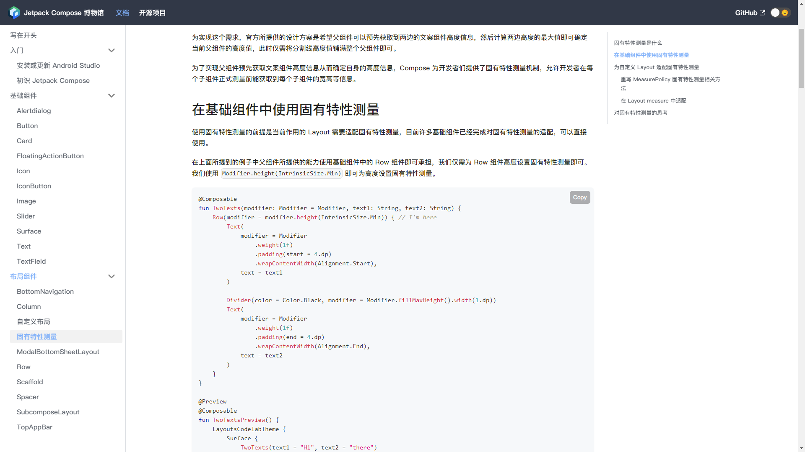

## 介绍 💨

### Jetpack Compose 基础教程 (Jetpack Compose Tutorial) （开发中 ing... 咕咕咕） 

此项目致力于帮助大家更好的理解和快速上手 Jetpack Compose 框架, 更多的部分是为了补充官网可能没有介绍的东西

有问题欢迎提交 [issue](https://github.com/compose-museum/jetpack-compose-tutorial/issues/new) 来提问

欢迎来学习！ 




## 关于贡献

### Jetpack Compose
如果你想为 Jetpack Compose 做贡献的话，你可以加入 [Kotlin](https://surveys.jetbrains.com/s3/kotlin-slack-sign-up) 的 Slack 频道 **#Compose**, 或者在 [https://issuetracker.google.com/issues?q=componentid:612128](https://issuetracker.google.com/issues?q=componentid:612128) 中提交 Compose 的 Bug 或者错误

### [关于 Codelabs](https://docs.compose.net.cn/codelabs/)

### 本项目

我们非常欢迎各种的 PR 请求（~~包括但不局限于添加一个换行增加阅读体验~~），_(:з)∠)_本项目还处于初期阶段，非常需要各位大佬的完善和纠错

如果你有已经写好的文章想要添加到这里，欢迎发送 Markdown 格式的文件给我们！

文档采用 [docusaurus](https://docusaurus.io/) 来编辑及部署


### 在本地编辑&测试

#### 1. fork 仓库

```
npm install
```

在项目根目录终端执行 `npm run start`，将会在 [`http://localhost:3000/`](http://localhost:3000/) 看到文档

#### 2. 如何添加/更改文档？
    
文档都是由 **Markdown** 语法来编写的，所有文档位于 [/docs](https://github.com/compose-museum/compose-tutorial/tree/master/docs) 中, 如果需要扩展左边的侧边栏，请在 [**sidebars.js**](sidebars.js) 更新。

图片添加需要在 **static/img/** 下，和文档同等路径名字添加。例如如果我修改了 **Text** 的文档，并且添加了一张例图，那么就是放在 **/static/img/elements/text/xxx.png**。

[调用图片方法](https://docusaurus.io/zh-CN/docs/static-assets)

#### 3. 测试

运行 `npm run-script build` 会生成 `build` 文件夹，期间 `docusaurus` 会打印日志告诉你是否有 WARNING 或者 ERROR（一般可能是路径错误等）


#### 4. 最后

恭喜你，当你同步了本项目的最新进度并且添加了你所想的东西，你只需要提交 PR 即可，我们在审核通过会自动同步到网站上


#### 如果你觉得此项目对你有帮助的话，不妨点个 Star 支持下作者吧~！

## 贡献者 ❤

<a href="https://github.com/compose-museum/hello-compose/graphs/contributors">
  
</a>

### License
```
MIT License

Copyright (c) 2021 Compose-Museum

Permission is hereby granted, free of charge, to any person obtaining a copy
of this software and associated documentation files (the "Software"), to deal
in the Software without restriction, including without limitation the rights
to use, copy, modify, merge, publish, distribute, sublicense, and/or sell
copies of the Software, and to permit persons to whom the Software is
furnished to do so, subject to the following conditions:

The above copyright notice and this permission notice shall be included in all
copies or substantial portions of the Software.

THE SOFTWARE IS PROVIDED "AS IS", WITHOUT WARRANTY OF ANY KIND, EXPRESS OR
IMPLIED, INCLUDING BUT NOT LIMITED TO THE WARRANTIES OF MERCHANTABILITY,
FITNESS FOR A PARTICULAR PURPOSE AND NONINFRINGEMENT. IN NO EVENT SHALL THE
AUTHORS OR COPYRIGHT HOLDERS BE LIABLE FOR ANY CLAIM, DAMAGES OR OTHER
LIABILITY, WHETHER IN AN ACTION OF CONTRACT, TORT OR OTHERWISE, ARISING FROM,
OUT OF OR IN CONNECTION WITH THE SOFTWARE OR THE USE OR OTHER DEALINGS IN THE
SOFTWARE.

```
