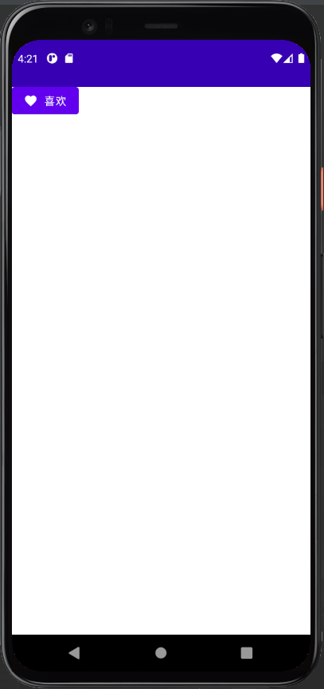

```kotlin
@OptIn(ExperimentalMaterialApi::class)
@Composable
fun Button(
    onClick: () -> Unit,
    modifier: Modifier = Modifier,
    enabled: Boolean = true,
    interactionSource: MutableInteractionSource = remember { MutableInteractionSource() },
    elevation: ButtonElevation? = ButtonDefaults.elevation(),
    shape: Shape = MaterialTheme.shapes.small,
    border: BorderStroke? = null,
    colors: ButtonColors = ButtonDefaults.buttonColors(),
    contentPadding: PaddingValues = ButtonDefaults.ContentPadding,
    content: @Composable RowScope.() -> Unit
)
```

**Compose** 的 `Button` 是基于 **Material Design** 实现的，和传统的 **XML Button** 截然不同

以下是简单创建一个默认的 `Button` 代码：

``` kotlin
import androidx.compose.material.Button
import androidx.compose.material.Text

@Composable
fun ButtonDemo() {
    Button(onClick = { /*TODO*/ }) {
        Text("确认")
    }
}
```

效果如图所示：


也许您想添加图标在文字的旁边，也只需：

``` kotlin
@Composable
fun ButtonDemo() {
    Button(onClick = { /*TODO*/ }) {
        Icon(
            // Material 库中的图标，有 Filled, Outlined, Rounded, Sharp, Two Tone 等
            Icons.Filled.Favorite,
            contentDescription = null,
            modifier = Modifier.size(ButtonDefaults.IconSize)
        )
        // 添加间隔
        Spacer(Modifier.size(ButtonDefaults.IconSpacing))
        Text("喜欢")
    }
}
```




## 更多
[Button 参数详情](https://developer.android.com/reference/kotlin/androidx/compose/material/package-summary#button)