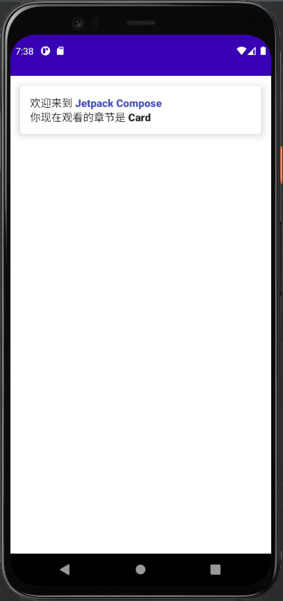

`Card` 是 Compose 中一个非常好用的布局组件，我们用它可以来创造出很优美的界面

``` kotlin
class MainActivity : ComponentActivity() {
    override fun onCreate(savedInstanceState: Bundle?) {
        super.onCreate(savedInstanceState)
        setContent {
            ExamplesTheme() { // 和每个人的项目名不同
                CardDemo()
            }
        }
    }
}

@Composable
fun CardDemo() {
    Card(
        modifier = Modifier
            .fillMaxWidth()
            .padding(15.dp) // 外边距
            .clickable{ },  

            // 设置点击波纹效果，注意如果 CardDemo() 函数不在 ExamplesTheme() {} 下调用
            // 将无法显示波纹效果

        elevation = 10.dp // 设置阴影
    ) {
        Column(
            modifier = Modifier.padding(15.dp) // 内边距
        ) {
            Text(
                buildAnnotatedString {
                    append("欢迎来到 ")
                    withStyle(style = SpanStyle(fontWeight = FontWeight.W900, color = Color(0xFF4552B8))
                    ) {
                        append("Jetpack Compose 博物馆")
                    }
                }
            )
            Text(
                buildAnnotatedString {
                    append("你现在观看的章节是 ")
                    withStyle(style = SpanStyle(fontWeight = FontWeight.W900)) {
                        append("Card")
                    }
                }
            )
        }
    }
}
```



## 最后

[Card 参数详情](https://developer.android.com/reference/kotlin/androidx/compose/material/package-summary#card)