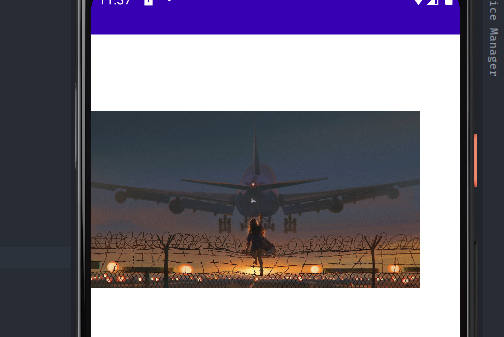
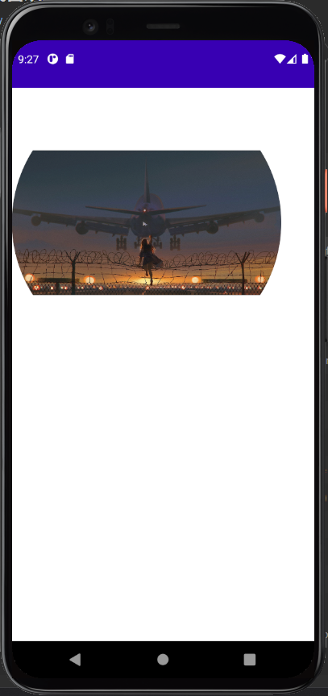

`Image` 可以帮我们加载一张图片

``` kotlin
@Composable
fun ImageDemo() {

    Image(
        painter = painterResource(id = R.drawable.wallpaper),
        contentDescription = null
    )

}
```


## 1. 图片大小

我们可以使用 `Modifier.size()` 来设置图片大小

``` kotlin
@Composable
fun ImageDemo() {

    Image(
        painter = painterResource(id = R.drawable.wallpaper),
        contentDescription = null,
        modifier = Modifier.size(350.dp)
    )

}
```



## 2. 图片形状

我们可以使用 `Surface` 来帮助我们设置形状

``` kotlin
@Composable
fun ImageDemo() {

    Surface(
        shape = CircleShape
    ) {
        Image(
            painter = painterResource(id = R.drawable.wallpaper),
            contentDescription = null,
            modifier = Modifier.size(350.dp)
        )
    }

}
```



是不是有一点小问题？似乎只有左右两边变成了圆形，而上下并没有

这是因为 `Image` 中源码的 `contentScale` 参数默认是 `ContentScale.Fit`，

也就是保持图片的宽高比，缩小到可以完整显示整张图片

而 `ContentScale.Crop` 也是保持宽高比，但是尽量让宽度**或者**高度完整的占满

所以我们将 `contentScale` 设置成 `ContentScale.Crop`

``` kotlin
@Composable
fun ImageDemo() {

    Surface(
        shape = CircleShape
    ) {
        Image(
            painter = painterResource(id = R.drawable.wallpaper),
            contentDescription = null,
            modifier = Modifier.size(350.dp),
            contentScale = ContentScale.Crop
        )
    }

}
```


## 3. 更多

[Image 参数详情](https://developer.android.com/reference/kotlin/androidx/compose/foundation/package-summary#image)

[Ucrop 一个图片裁剪库](https://github.com/Yalantis/uCrop)