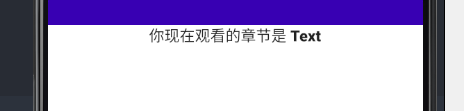
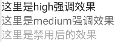

`Text` 是 `Compose` 中最基本的布局组件，它可以显示文字


``` kotlin
@Composable
fun TextDemo() {
    Column{
        Text("Hello World")
    }
}
```

## 1. style 参数

当然，我们有时候也需要更换字体的大小

`Compose` 已经为我们准备了很多专门的字体大小, 从 `h1` 到 `overline`

``` kotlin
@Composable
fun TextDemo() {

    // 如果对 Column 感到陌生可以到 布局/Column 下查看

    Column(
        modifier = Modifier.fillMaxWidth(), // 设置占满整行
        horizontalAlignment = Alignment.CenterHorizontally // 设置居中
    ) {
        Text(
            text = "你好陌生人",
            style = MaterialTheme.typography.h6
        )
    }
}
```


当然有的时候我们想自己自定义字体的间隔和大小，那我们可以将代码改为：

``` kotlin
@Composable
fun TextDemo() {
    Column(
        modifier = Modifier.fillMaxWidth(),
        horizontalAlignment = Alignment.CenterHorizontally
    ) {
        Text(
            text = "你好陌生人",
            style = TextStyle(
                fontWeight = FontWeight.W900, //设置字体粗细
                fontSize = 20.sp,
                letterSpacing = 7.sp
            )
        )
    }
}
```

它将会显示成


## 2. 文字按钮

有的时候也许您需要将文本当作按钮，那么只需要添加 `Modifier.clickable` 即可

代码如下：

``` kotlin
@Composable
fun TextDemo() {
    Text(
        text = "确认编辑",
        modifier = Modifier.clickable(
            onClick = {
                  // TODO
            },
        )
    )
}
```

但是我们会发现，`clickable` 有自带的波纹效果，如果我们想要取消的话，只需要添加两个参数即可:

``` kotlin
@Composable
fun TextDemo() {

    // 获取 context
    val context = LocalContext.current

    Text(
        text = "确认编辑",
        modifier = Modifier.clickable(
            onClick = {
                // 通知事件
                Toast.makeText(context, "你点击了此文本", Toast.LENGTH_LONG).show()
            },
            indication = null,
            interactionSource = MutableInteractionSource()
        )
    )

}
```

效果如下:


## 3. 特定的文字显示

如果我们想让一个 `Text` 语句中使用不同的样式，比如粗体提醒，特殊颜色

则我们需要使用到 `AnnotatedString`

`AnnotatedString` 是一个数据类，其中包含了：

* 一个 `Text` 的值
* 一个 `SpanStyleRange` 的 `List`，等同于位置范围在文字值内的内嵌样式
* 一个 `ParagraphStyleRange` 的 `List`，用于指定文字对齐、文字方向、行高和文字缩进样式

一个简单的代码演示：
``` kotlin
@Composable
fun TextDemo() {
    Column(
        modifier = Modifier.fillMaxWidth(),
        horizontalAlignment = Alignment.CenterHorizontally
    ) {
        Text(
            buildAnnotatedString {
                append("你现在观看的章节是 ")
                withStyle(style = SpanStyle(fontWeight = FontWeight.W900)) {
                    append("Text")
                }
            }
        )
    }
}
```

效果如下：




## 4. textAlign 参数

当我们在 `Text` 中设置了 `fillMaxWidth()` 之后，我们可以指定 `Text` 的对齐方式

``` kotlin
@Composable
fun TextDemo() {
    Column {
        Text(
            text = "每天摸鱼",
            modifier = Modifier.fillMaxWidth(),
            textAlign = TextAlign.Left
        )
        Text(
            text = "这好吗",
            modifier = Modifier.fillMaxWidth(),
            textAlign = TextAlign.Center
        )
        Text(
            text = "这非常的好",
            modifier = Modifier.fillMaxWidth(),
            textAlign = TextAlign.Right
        )
    }
}
```


## 5. 复制文字

默认情况下 `Text` 并不能进行复制等操作，我们需要设置 `SelectionContainer` 来包装 `Text`

``` kotlin
@Composable
fun TextDemo() {
    
    SelectionContainer {
        Column{
            Text(
                text = "每天摸鱼",
                modifier = Modifier.fillMaxWidth(),
                textAlign = TextAlign.Left
            )
            Text(
                text = "这好吗",
                modifier = Modifier.fillMaxWidth(),
                textAlign = TextAlign.Center
            )
            Text(
                text = "这非常的好",
                modifier = Modifier.fillMaxWidth(),
                textAlign = TextAlign.Right
            )
        }
    }
    
}
```


## 6. 文字强调效果
文字根据不同情况来确定文字的强调程度，以突出重点并体现出视觉上的层次感。Material Design 建议采用不同的不透明度来传达这些不同的重要程度，你可以通过 LocalContentAlpha 实现此功能。   
您可以通过为此 CompositionLocal 提供一个值来为层次结构指定内容 Alpha 值。（CompositionLocal是一个用于隐式的传递参数的组件，后续会讲到）
```kotlin
// 将内部Text组件的alpha强调程度设置为高
// 注意: MaterialTheme已经默认将强调程度设置为high
CompositionLocalProvider(LocalContentAlpha provides ContentAlpha.high) {
    Text("这里是high强调效果")
}
// 将内部Text组件的alpha强调程度设置为中
CompositionLocalProvider(LocalContentAlpha provides ContentAlpha.medium) {
    Text("这里是medium强调效果")
}
// 将内部Text组件的alpha强调程度设置为禁用
CompositionLocalProvider(LocalContentAlpha provides ContentAlpha.disabled) {
    Icon("这里是禁用后的效果")
}
```
这是运行效果:   



## 7. 更多

[Text 参数详情](https://developer.android.com/reference/kotlin/androidx/compose/material/package-summary#text)

[Text 一些用法](https://developer.android.com/jetpack/compose/text)