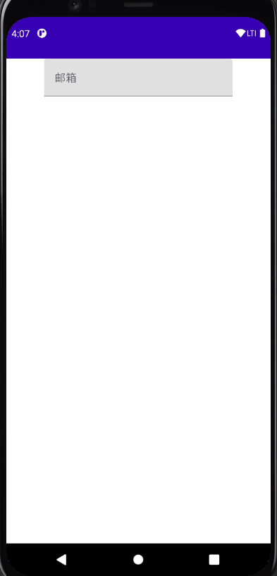

`textfield` 可以创建一个输入框。

一个简单使用的例子是这样的：

``` kotlin
import androidx.compose.runtime.*

@Composable
fun TextFieldDemo() {
    var text by remember{ mutableStateOf("")}

    TextField(
        value = text,
        onValueChange = {
            text = it
        }
    )
}
```


## 1. singleLine 参数

使用 `singleLine` 参数可以将 `TextField` 设置成只有一行

设置了 `singleLine` 再设置 `maxLines` 将无效

``` kotlin
@Composable
fun TextFieldDemo() {
    var text by remember{ mutableStateOf("")}

    TextField(
        value = text,
        onValueChange = {
            text = it
        },
        singleLine = true
    )
}
```

## 2. label 参数

label 标签可以运用在 `TextField` 中，当聚焦的时候会改变字体大小

``` kotlin
@Composable
fun TextFieldDemo() {
    var text by remember{ mutableStateOf("")}

    Column(
        modifier = Modifier
            .fillMaxWidth(),
        horizontalAlignment = Alignment.CenterHorizontally
    ) {
        TextField(
            value = text,
            onValueChange = {
                text = it
            },
            singleLine = true,
            label = {
                Text("邮箱")
            }
        )
    }
}
```




## 更多

[TextField 参数详情](https://developer.android.com/reference/kotlin/androidx/compose/material/package-summary#textfield)