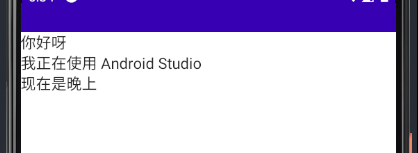
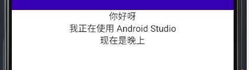

<div align = center>

</div>


`Column` 是 Jetpack Compose 中一个很基本的布局种类，它会将里面的**每个**组件以行的形式呈现

``` kotlin
@Composable inline fun Column(
    modifier: Modifier = Modifier, 
    verticalArrangement: Arrangement.Vertical = Arrangement.Top, 
    horizontalAlignment: Alignment.Horizontal = Alignment.Start, 
    content: ColumnScope.() -> Unit
): Unit
```

## 1. Text 在 Column 里面的使用

``` kotlin
class MainActivity : ComponentActivity() {

    override fun onCreate(savedInstanceState: Bundle?) {
        super.onCreate(savedInstanceState)
        setContent {
            ColumnDemo()
        }
    }
}

@Composable
fun ColumnDemo() {
    Column{
        Text("你好呀")
        Text("我正在使用 Android Studio")
        Text("现在是晚上")
    }
}
```
效果如下：



### 1.居中文字

如果我们需要将 Column 里面的文字居中该怎么办呢？

很简单，我们只需要添加 `modifier` 和 `horizontalAlignment` 参数

代码如下:

```kotlin
@Composable
fun ColumnDemo() {
    Column(
        modifier = Modifier.fillMaxWidth(),
        horizontalAlignment = Alignment.CenterHorizontally
    ) {
        Text("你好呀")
        Text("我正在使用 Android Studio")
        Text("现在是晚上")
    }
}
// 我们要注意的是，如果不添加 Modifier.fillMaxWidth()
// Column 的宽度将取决于里面最宽控件的长度
```
效果如下：



### 2.特定文字居中

如果我们想让 `Column` 里面的某些文字居中而不是全部居中怎么办

我们只需要在需要居中的文字的地方添加 `Modifier.align` 参数，并且将 `Column` 的 `modifier` 参数设置为 `fillMaxWidth()` 即可实现效果

代码如下：
``` kotlin
@Composable
fun ColumnDemo() {
    Column(
        modifier = Modifier.fillMaxWidth()
    ){

        Text(
            text = "夜色",
            modifier = Modifier.align(Alignment.CenterHorizontally),
            style = MaterialTheme.typography.h6,
            fontWeight = FontWeight.W900)

        Text("今晚的夜色很不错，我和朋友走在河边的小路上，看到了很多美丽的风景")
    }
}
```

效果如下：

