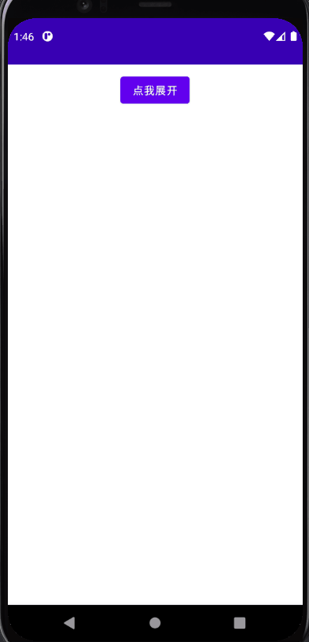

## 1. ModalBottomSheetLayout 概述

`ModalBottomSheetLayout` 呈现了一系列的选择，同时阻止了与屏幕其他部分的互动。

它们是移动端上内嵌式菜单和简单对话框的替代方案，为内容、图标和操作提供了额外的空间

一个简单的 `ModalBottomSheetLayout` 的例子是这样的：

``` kotlin
val state = rememberModalBottomSheetState(ModalBottomSheetValue.Hidden)
val scope = rememberCoroutineScope()
ModalBottomSheetLayout(
    sheetState = state,
    sheetContent = {
        Column{
            ListItem(text = {Text("选择分享到哪里吧~")})

            ListItem(text = {Text("github")}, icon = {
                Surface(
                    shape = CircleShape,
                    color = Color(0xFF181717)
                ) {
                    Icon(
                        painterResource(R.drawable.github),
                        null,
                        tint = Color.White,
                        modifier = Modifier.padding(4.dp)
                    )
                }
            },modifier = Modifier.clickable {  })

            ListItem(text = {Text("微信")}, icon = {
                Surface(
                    shape = CircleShape,
                    color = Color(0xFF07C160)
                ) {
                    Icon(
                        painterResource(R.drawable.wechat),
                        null,
                        tint = Color.White,
                        modifier = Modifier.padding(4.dp)
                    )
                }
            },modifier = Modifier.clickable {  })
        }
    }
) {
    Column(
        modifier = Modifier
            .fillMaxSize()
            .padding(16.dp),
        horizontalAlignment = Alignment.CenterHorizontally
    ) {
        Button(onClick = { scope.launch { state.show() } }) {
            Text("点我展开")
        }
    }
}
```



!!! 注意
    目前使用 `ModalBottomSheetLayout` 需要标明 `@ExperimentalMaterialApi`


## 2. 收回 ModalBottomSheet

一般情况下，`ModalBottomSheet` 无法自动处理按下返回键就收起，所以我们可以用 `BackHandler` 来处理

在 `ModalBottomSheet` 后添加代码：

``` kotlin
BackHandler(
    enabled = (state.currentValue == ModalBottomSheetValue.HalfExpanded
            || state.currentValue == ModalBottomSheetValue.Expanded),
    // 通过 Log 打印日志可以发现，`SheetState` 有两种状态
    // HalfExpanded 和 Expanded
    onBack = {
        scope.launch{
            state.hide()
        }
    }
)
```


## 3. 更多

[ModalBottomSheet 参数详情](https://developer.android.com/reference/kotlin/androidx/compose/material/package-summary#ModalBottomSheetLayout(kotlin.Function1,androidx.compose.ui.Modifier,androidx.compose.material.ModalBottomSheetState,androidx.compose.ui.graphics.Shape,androidx.compose.ui.unit.Dp,androidx.compose.ui.graphics.Color,androidx.compose.ui.graphics.Color,androidx.compose.ui.graphics.Color,kotlin.Function0))