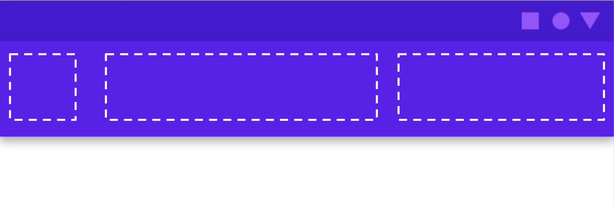
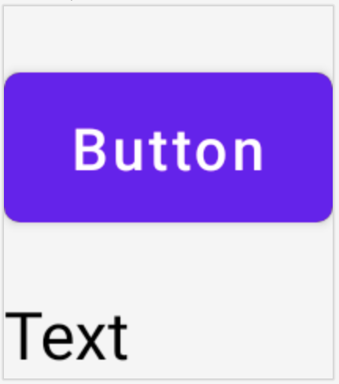
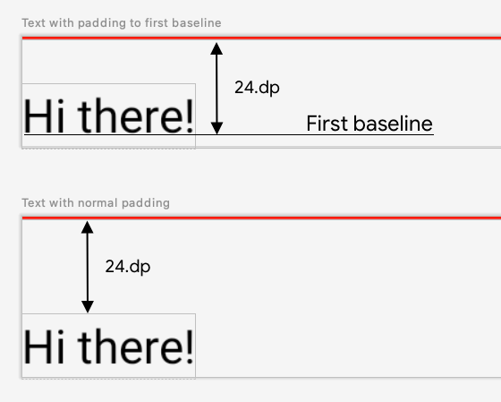
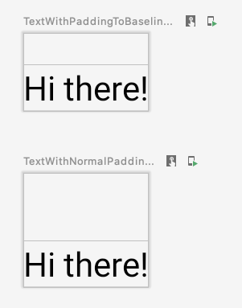

## Layouts in Compose

** 本章节翻译自[官方文档](https://developer.android.com/jetpack/compose/layout) 并加了一些注释 **

** 如有翻译不准确欢迎提交 issue / pr ！**


**Jetpack Compose** 让设计和构建你的 app UI 变得更加容易。

这篇文档解释了 ``Compose`` 提供的一些构建模块，以帮助你布置你的 UI 元素，并告诉你如何在你需要的时候建立更专业的布局。

***Composable*** 函数是 ``Compose`` 的基本构建模块，一个 ***Composable*** 的函数是一个 emitting `Unit` (通过声明式的语法去显示出一个界面元素?) 的函数，描述你的用户界面的某些部分。该函数接受一些输入并生成屏幕上显示的内容。

一个 ***Composable*** 函数可能会包含多个 **UI** 元素。但是，如果你不告诉它们应该如何被排列，``Compose`` 可能不会按照你所想的方式来排列它们。

例如，这段代码生成了两个 `Text` 元素

``` kotlin
@Composable
fun ArtistCard() {
    Text("Alfred Sisley")
    Text("3 minutes ago")
}
```

在你没有排列它们的情况下， `Compose` 会将 `Text` 元素堆叠在一起，变得无法阅读。


`Compose` 提供了一个现成的布局集合，以帮助你安排你的 `UI` 元素，并使你更容易定义你自己的、更专业的布局。

## 1. 标准布局组件

使用 `Column` 它会将里面的组件以行的形式呈现。

``` kotlin
@Composable
fun ArtistCard() {
    Column {
        Text("Alfred Sisley")
        Text("3 minutes ago")
    }
}
```


同样地，你也可以使用 `Row`, 它会将里面的组件以列的形式呈现。

`Column` 和 `Row` 都支持配置它们所包含的元素的对齐方式。

``` kotlin
@Composable
fun ArtistCard(artist: Artist) {
    Row(verticalAlignment = Alignment.CenterVertically) {
        Image( /*...*/ )
        Column {
            Text(artist.name)
            Text(artist.lastSeenOnline)
        }
    }
}
```


!!! 注意
    图中的圆形图像的效果可以在 **基本组件/Image** 中实现。
    图中的文字效果可以在 **基本组件/Text** 中实现。

关于 `Row` 的详情可以参考 [这里](row.md)

!!! Tips 
    注意：Compose 有效地处理嵌套布局，使其成为设计复杂UI的好方法。这是对 Android Views 的改进，在 Android Views 中，出于性能原因，您需要避免嵌套布局。

如果想要在 `Row` 中设置子项的位置，可以设置 `horizontalArrangement` 和 `verticalAlignment` 参数，

对于 `Column` 来说，设置 `verticalArrangement` 和 `horizontalAlignment`。

``` kotlin
@Composable
fun AlignInRow() {
    Row(
        modifier = Modifier
            .size(150.dp)
            .background(Color.Yellow),
        horizontalArrangement = Arrangement.End, // 设置 Row 中的子项水平布局为最右边
        verticalAlignment = Alignment.CenterVertically // 设置 Row 中的子项竖直布局为中心
        // start 左边
        // end 右边
        // top 上边
        // bottom 下边
    ) {
        Box(Modifier.size(50.dp).background(Color.Red))
        Box(Modifier.size(50.dp).background(Color.Blue))
    }
}
```


## 2. Modifier

`Modifier` 允许你装饰或增强一个 ***Composable***， `Modifier` 允许你做以下的事情

* 改变 ***Composable*** 的大小、布局、行为和外观
* 添加信息，如无障碍标签
* 处理用户的输入
* 添加高层次的交互，比如让一个元素可点击、可滚动、可拖动或可缩放
* 修改器是标准的 **Kotlin** 对象。通过调用 `Modifier` 类的一个函数来创建一个 `modifier`。你可以把这些函数串联起来，组成它们：

``` kotlin
@Composable
fun ArtistCard(
    artist: Artist,
    onClick: () -> Unit
) {
    val padding = 16.dp
    Column(
        Modifier
            .clickable(onClick = onClick)
            .padding(padding)
            .fillMaxWidth()
    ) {
        Row(verticalAlignment = Alignment.CenterVertically) { /*...*/ }
        Spacer(Modifier.size(padding))
        Card(elevation = 4.dp) { /*...*/ }
    }
}
```


在上面的代码中，你会注意到不同的 `modifier` 函数一起使用

* `clickable` 使一个 ***Composable*** 元素对用户的点击作出反应，并显示一个波纹
* `padding` 在一个元素的周围填充了空间
* `fillMaxWidth` 让 ***Composable*** 元素填满其父元素的最大宽度
* `size()` 来指定一个元素的宽度和高度


!!! 注意
    在其他方面，`Modifier` 的作用类似于基于 `view` 布局中的布局参数。然而，由于 `Modifier` 有时是特定范围的，它们提供了类型安全，也帮助你发现和理解什么是可用的，适用于某个布局。对于 XML 布局，有时很难发现某个特定的布局属性是否适用于某个视图。

`Modifier` 函数的顺序是很**重要**的。因为每个函数都会对前一个函数返回的修改器进行修改，所以顺序会影响最终的结果。让我们来看看这个例子：

``` kotlin
@Composable
fun ArtistCard(/*...*/) {
    val padding = 16.dp
    Column(
        Modifier
            .clickable(onClick = onClick)
            .padding(padding)
            .fillMaxWidth()
    ) {
        // rest of the implementation
    }
}
```


在上面的代码中，整个区域都是可点击的，包括周围的填充物，因为 `padding modifier` 被应用在 `clickable` 之后。如果 `modifier` 的顺序颠倒了，那么由 `padding` 增加的空间就不会对用户的输入做出反应。

``` kotlin
@Composable
fun ArtistCard(/*...*/) {
    val padding = 16.dp
    Column(
        Modifier
            .padding(padding)
            .clickable(onClick = onClick)
            .fillMaxWidth()
    ) {
        // rest of the implementation
    }
}
```


!!! 注意

    明确顺序有助于你推理不同的 `Modifier` 将如何相互作用。与基于 `view` 的系统相比，你必须学习盒子模型，即在元素的 "外面" 应用 `margin`，而在 "里面 "应用 `pading`，背景元素会有相应的大小
    `Modifier` 的设计使这种行为变得明确和可预测，并给你更多的控制来实现你想要的确切行为。这也解释了为什么没有 `margin` 修改器而只有 `padding` 修改器

### 内置 modifiers

Jetpack Compose 提供了一个内置 `modifiers` 的列表，以帮助你装饰或增强一个 ***Composable***。下面是一个涵盖最常见的使用情况的列表：

#### 1. Padding 和 size

要在一个 ***Composable*** 的周围进行填充，请添加 `padding`

``` kotlin
@Composable
fun PaddedComposable() {
    Text(
        text = "Hello World", 
        modifier = Modifier
            .background(Color.Green)
            .padding(20.dp)
    )
}
```


默认情况下，Compose 中提供的布局是包裹其子项的。

然鹅，你可以通过使用 `size` 来设置一个尺寸

``` kotlin
@Composable
fun SizedComposable() {
    Box(Modifier.size(100.dp, 100.dp).background(Color.Red))
}
```

!!! 注意
    如果您指定的尺寸不满足来自布局父级的约束，则可能无法使用该尺寸。如果你要求的 ***Composable*** 的尺寸是固定的，不管传入的约束条件如何，请使用 `requiredSize`

``` kotlin
@Composable
fun FixedSizeComposable() {
    Box(
        Modifier
        .size(90.dp, 150.dp)
        .background(Color.Green)
    ) {
        Box(
            Modifier
            .requiredSize(100.dp, 100.dp)
            .background(Color.Red)
        )
    }
}
```


在这个例子中，即使父本的宽度被设置为 `90.dp`，内盒的宽度也将是 `100.dp`

因为内盒的 `requiredSize` 优先

``` kotlin
@Composable
fun FillSizeComposable() {
    Box(
        Modifier
            .background(Color.Green)
            .size(50.dp)
            .padding(10.dp)
    ) {
        Box(
            Modifier
                .background(Color.Blue)
                .fillMaxSize()
        )
    }
}
```


如果你想让一个子布局的尺寸与父 `Box` 的尺寸相同而不影响 `Box` 的尺寸，请使用 `matchParentSize `

请注意，`matchParentSize` 只在 `Box` 范围内可用，也就是说，它只适用于 `Box` ***composables*** 的直接子代

在下面的例子中，内部的 `Spacer` 从它的父 `Box` 中获取其大小，而父 `Box` 又从它包含的 `Text` 中获取其大小

``` kotlin
@Composable
fun MatchParentSizeComposable() {
    Box {
        Spacer(Modifier.matchParentSize().background(Color.Green))
        Text("Hello World")
    }
}
```


如果使用 `fillMaxSize` 而不是` matchParentSize`，那么 `Spacer` 将占用允许给父代的所有可用空间，反过来导致父代扩展并填充所有可用空间


如果你想在文本基线上方添加 `padding` 使你达到从布局顶部到基线的特定距离

那么请使用 `paddingFromBaseline`

``` kotlin
@Composable
fun TextWithPaddingFromBaseline() {
    Box(Modifier.background(Color.Yellow)) {
        Text("Hi there!", Modifier.paddingFromBaseline(top = 32.dp))
    }
}
```


#### 2. offset

要将一个布局相对于它的原始位置进行定位，可以添加 `offet`，并在 x 和 y 轴上设置偏移量

偏移量可以是正的，也可以是负的。`padding` 和 `offset` 的区别在于，给一个 ***Composable*** 添加 `offset` 并不会改变它的测量

``` kotlin
@Composable
fun OffsetComposable() {
    Box(Modifier.background(Color.Yellow).size(width = 150.dp, height = 70.dp)) {
        Text(
            "Layout offset modifier sample",
            Modifier.offset(x = 15.dp, y = 20.dp)
        )
    }
}
```


`padding` modifier 根据布局方向在水平方向上应用。在从左到右的情况下，正的偏移值会将元素向右移动，而在从右到左的情况下，它会将元素向左移动。如果你需要在不考虑布局方向的情况下设置一个偏移量，请参见`absoluteOffset` 修改器，其中一个正的偏移值总是将元素向右移动

## 3. 响应性布局

设计布局时应考虑到不同的屏幕方向和外形尺寸。`Compose` 提供了一些机制来促进你的 ***Composable*** 布局适应各种屏幕配置

### Row 和 Column 中的 weight modifier

正如你在前面关于填充和尺寸的章节中所看到的，一个 ***Composable*** 尺寸默认是由它所包裹的内容来定义的。你可以将一个 ***Composable*** 尺寸设置为在其父级内容中具有灵活性。让我们来看看一个包含两个盒子的行的可组合尺寸。

第一个盒子的权重是第二个盒子的两倍，所以它的宽度也是两倍。因为行的宽度是 `210.dp`，所以第一个盒子的宽度是 `140.dp`，而第二个是 `70.dp`

``` kotlin
@Composable
fun FlexibleComposable() {
    Row(Modifier.width(210.dp)) {
        Box(Modifier.weight(2f).height(50.dp).background(Color.Blue))
        Box(Modifier.weight(1f).height(50.dp).background(Color.Red))
    }
}
```


## 4. 约束条件

为了知道来自父体的约束并相应地设计布局，你可以使用 `BoxWithConstraints`。测量约束可以在 `content lambda` 的范围内找到。你可以使用这些测量约束来为不同的屏幕配置组成不同的布局

``` kotlin
@Composable
fun WithConstraintsComposable() {
    BoxWithConstraints {
        Text("My minHeight is $minHeight while my maxWidth is $maxWidth")
    }
}
```


#### 基于插槽的布局

`Compose` 通过 `androidx.compose.material:material` 依赖关系（在 Android Studio 中创建 `Compose` 工程时会包含在内）提供了大量基于 `Material Design `的可组合元素，使 UI 构建变得简单。像   `Drawer`、`FloatingActionButton` 和 `TopAppBar` 这样的元素都被提供。

Material 组件大量使用插槽 API，这是 `Compose` 引入的一种模式，在可组合的基础上引入了一层定制。这种方法使组件更加灵活，因为它们接受一个可以自我配置的子元素，而不是必须暴露子元素的每一个配置参数。槽在用户界面中留下了一个空位，供开发者按照自己的意愿来填充。例如，这些是你可以在 `TopAppBar` 中自定义的位置



***Composable*** 通常采取一个内容可组合的 `lambda ( content: @Composable () -> Unit)`。插槽 API 为特定用途公开了多个内容参数。例如，`TopAppBar` 允许你为标题、导航图标和行为提供内容。

例如，[Scaffold](scaffold/overview.md) 允许你用基本的 `Material Design` 布局结构来实现一个 UI。`Scaffold` 为最常见的顶层 `Material` 组件提供了插槽，如 [TopAppBar](https://material.io/components/app-bars-top#usage)、[BottomAppBar](https://material.io/components/app-bars-bottom/)、[FloatingActionButton](https://material.io/components/buttons-floating-action-button/) 和 [Drawer](https://material.io/components/navigation-drawer) 。通过使用 `Scaffold`，我们可以很容易地确保这些组件被正确地定位并正确地协同工作

!!! Tips
    要更好的了解 **Scaffold** 可以参考[这里](scaffold/overview.md)


``` kotlin
@Composable
fun HomeScreen(/*...*/) {
    Scaffold(
        drawerContent = { /*...*/ },
        topBar = { /*...*/ },
        bodyContent = { /*...*/ }
    )
}
```

## 5. ConstraintLayout

`ConstraintLayout` 可以帮助在屏幕上放置相对于其他的合成物，并且是使用多个嵌套的 `Row`, `Column`, `Box` 自定义布局元素的替代方案。

`ConstraintLayout` 在实现具有更复杂对齐要求的大型布局时很有用，但在创建简单的布局时，最好使用 `Columns`和 `Rows` 来代替。

要在 `Compose` 中使用 `ConstraintLayout`，你需要在 `build.gradle` 中添加这个依赖项

```
implementation "androidx.constraintlayout:constraintlayout-compose:1.0.0-alpha05"
```

!!! 注意
    注意：在 `View` 系统中，`ConstraintLayout` 是创建大型复杂布局的推荐方式，因为扁平的视图层次结构比嵌套的视图更有利于性能。然而，这在 `Compose` 中并不是一个问题，它能够有效地处理深层次的布局层次结构

`Compose` 中的 `ConstraintLayout` 以 [DSL](https://kotlinlang.org/docs/type-safe-builders.html) 方式工作。

引用是用 `createRefs()` 或 `createRefFor()` 创建的，`ConstraintLayout` 中的每一个 ***Composable*** 都需要有一个与之相关的引用。
约束条件使用 `constrainAs()` modifier 提供，它将引用作为一个参数，让你在主体 `lambda` 中指定其约束。
约束条件使用 `linkTo()` 或其他有用的方法来指定。
`paren` t是一个现有的引用，可以用来指定对 `ConstraintLayout composable` 本身的约束

下面是一个使用 `ConstraintLayout` 的 ***Composable*** 例子：

``` kotlin
@Composable
fun ConstraintLayoutContent() {
    ConstraintLayout {
        // 给需要约束的 Composable 元素创建引用
        val (button, text) = createRefs()

        Button(
            onClick = { /* Do something */ },
            
            // 将 button 的引用给 Button 控件
            // 并且设置约束

            modifier = Modifier.constrainAs(button) {
                top.linkTo(parent.top, margin = 16.dp)
            }
        ) {
            Text("Button")
        }

            // 将 Text 的引用给 Text 控件
            // 并且设置约束

        Text("Text", Modifier.constrainAs(text) {
            top.linkTo(button.bottom, margin = 16.dp)
        })
    }
}
```

这段代码将 `Button` 的顶部约束到父级，边距为 `16.dp` ，将 `Text` 约束到 `Button` 的底部，边距也为 `16.dp`




关于如何使用 `ConstraintLayout` 的更多例子，请参阅 [layout codelab](https://developer.android.com/codelabs/jetpack-compose-layouts#0)

### 解耦的 API

在 `ConstraintLayout` 的例子中，约束条件是内联指定的，在它们所应用的 `composable` 中带有一个 modifier。然而，在有些情况下，最好将约束与它们所应用的布局解耦。例如，你可能想根据屏幕配置来改变约束，或者在两个约束集之间制作动画。

对于这样的情况，你可以用不同的方式来使用 `ConstraintLayout`：

- 传入一个 `ConstraintSet` 作为 `ConstraintLayout` 的参数。
- 使用 `layoutId` 修改器将 `ConstraintSet` 中创建的引用分配给 ***Composable***

``` kotlin
@Composable
fun DecoupledConstraintLayout() {
    BoxWithConstraints {
        val constraints = if (minWidth < 600.dp) {
            decoupledConstraints(margin = 16.dp) // 竖屏约束
        } else {
            decoupledConstraints(margin = 32.dp) // 横屏约束
        }

        ConstraintLayout(constraints) {
            Button(
                onClick = { /* Do something */ },
                modifier = Modifier.layoutId("button")
            ) {
                Text("Button")
            }

            Text("Text", Modifier.layoutId("text"))
        }
    }
}

private fun decoupledConstraints(margin: Dp): ConstraintSet {
    return ConstraintSet {
        val button = createRefFor("button")
        val text = createRefFor("text")

        constrain(button) {
            top.linkTo(parent.top, margin = margin)
        }
        constrain(text) {
            top.linkTo(button.bottom, margin)
        }
    }
}
```

然后，当你需要改变约束时，你可以只传递一个不同的 `ConstraintSet`


## 6. 自定义布局

在 `Compose` 中，UI 元素由 ***composable*** 函数表示，这些函数在被调用时发出一段 UI，然后被添加到一个 UI 树中，在屏幕上呈现。每个 UI 元素都有一个父元素和可能的许多子元素。每个元素都位于它的父元素中，被指定为一个（x，y）位置，以及一个尺寸，被指定为一个宽度和一个高度。

父元素为他们的子元素定义约束条件。一个元素被要求在这些约束中定义它的尺寸。约束条件限制了一个元素的最小和最大宽度和高度。如果一个元素有子元素，它可以测量每个子元素以帮助确定其尺寸。一旦一个元素确定并告知了它自己的尺寸，它有机会定义如何相对于自身放置子元素，就像在创建自定义布局中详细描述的。

注意：Compose UI 不允许多通道测量。这意味着一个布局元素不能多次测量它的任何子元素，以尝试不同的测量配置。

单遍测量有助于提高性能，使 `Compose` 可以有效处理深层 UI 树。如果一个元素测量了它的子元素两次，而这个子元素又测量了它的一个子元素两次，以此类推，那么一次尝试布局整个 UI 就必须做很多工作，这就很难让你的应用程序保持良好的性能。然而，有些时候，你真的需要在单个子项测量所能告诉你的信息之上的额外信息。有一些方法可以有效地应对这样的情况，这些方法将在内在的测量部分讨论

### 使用 layout modifier

你可以使用 layout modifier 来修改一个元素的测量和布局方式。`Layout` 是一个 `lambda`；它的参数包括你可以测量的元素，以可测量的方式传递，而这个 ***Composable*** 的传入约束则以约束的方式传递。一个自定义的 layout modifier 可以是这样的

``` kotlin
fun Modifier.customLayoutModifier(...) =
    this.layout { measurable, constraints ->
        ...
    })
```

让我们在屏幕上显示一个文本，并控制第一行文本从顶部到基线的距离。这正是 `paddingFromBaseline` 的作用，我们在这里作为一个例子来实现它。要做到这一点，请使用 layout modifier 来手动将 ***Composable*** 的东西放在屏幕上。

下面是期望的行为，文本顶部的 `padding` 被设置为 `24.dp`




下面是产生这种间距的代码：

```kotlin
fun Modifier.firstBaselineToTop(
    firstBaselineToTop: Dp
) = layout { measurable, constraints ->
    // Measure the composable
    val placeable = measurable.measure(constraints)

    // Check the composable has a first baseline
    check(placeable[FirstBaseline] != AlignmentLine.Unspecified)
    val firstBaseline = placeable[FirstBaseline]

    // Height of the composable with padding - first baseline
    val placeableY = firstBaselineToTop.roundToPx() - firstBaseline
    val height = placeable.height + placeableY
    layout(placeable.width, height) {
        // Where the composable gets placed
        placeable.placeRelative(0, placeableY)
    }
}
```


以下是那段代码中的内容：

1. 在 `measurablelambda` 参数中，你通过调用 `measurable.measure(constraints)` 来测量由 `measurabl` 参数代表的 `Text`。
2. 你通过调用 `layout(width, height)` 方法来指定 ***Composable*** 的尺寸，该方法也给出了一个用于放置包装元素的 `lambda`。在这种情况下，它是最后一个 `baseline` 和增加的 `top padding` 之间的高度。
3. 你可以通过调用 `placeable.place(x, y)` 将被包装好的元素放置在屏幕上。如果被包装的元素没有被放置，它们将不可见。`y` position 对应的是 `top padding` -- 文本的第一条 baseline 的位置。

为了验证这是否如预期的那样工作，请在 `Text` 上使用这个 **modifier**。


``` kotlin
@Preview
@Composable
fun TextWithPaddingToBaselinePreview() {
    MyApplicationTheme {
        Text("Hi there!", Modifier.firstBaselineToTop(32.dp))
    }
}

@Preview
@Composable
fun TextWithNormalPaddingPreview() {
    MyApplicationTheme {
        Text("Hi there!", Modifier.padding(top = 32.dp))
    }
}
```

