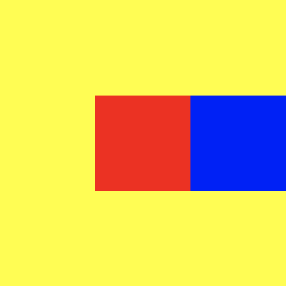
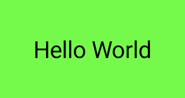
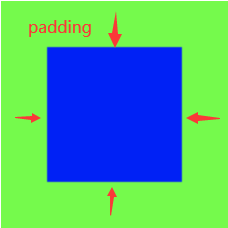
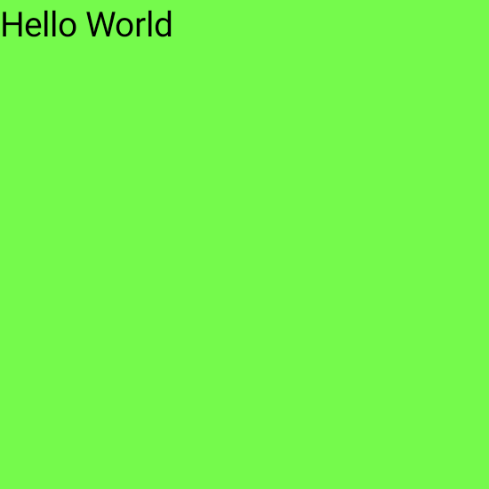

## Layouts in Compose

**Jetpack Compose** 让设计和构建你的 app UI 变得更加容易

这篇文档解释了 ``Compose`` 提供的一些构建模块，以帮助你布置你的 UI 元素，并告诉你如何在你需要的时候建立更专业的布局

***Composable*** 函数是 ``Compose`` 的基本构建模块，一个 ***Composable*** 的函数是一个 emitting `Unit` (通过声明式的语法去显示出一个界面元素?) 的函数，描述你的用户界面的某些部分。该函数接受一些输入并生成屏幕上显示的内容

一个 ***Composable*** 函数可能会包含多个 **UI** 元素。但是，如果你不告诉它们应该如何被排列，``Compose`` 可能不会按照你所想的方式来排列它们

例如，这段代码生成了两个 `Text` 元素

``` kotlin
@Composable
fun ArtistCard() {
    Text("Alfred Sisley")
    Text("3 minutes ago")
}
```

在你没有排列它们的情况下， `Compose` 会将 `Text` 元素堆叠在一起，变得无法阅读


`Compose` 提供了一个现成的布局集合，以帮助你安排你的 `UI` 元素，并使你更容易定义你自己的、更专业的布局

## 1. 标准布局组件

使用 `Column` 它会将里面的组件以行的形式呈现

``` kotlin
@Composable
fun ArtistCard() {
    Column {
        Text("Alfred Sisley")
        Text("3 minutes ago")
    }
}
```


同样地，你也可以使用 `Row`, 它会将里面的组件以列的形式呈现

`Column` 和 `Row` 都支持配置它们所包含的元素的对齐方式

``` kotlin
@Composable
fun ArtistCard(artist: Artist) {
    Row(verticalAlignment = Alignment.CenterVertically) {
        Image( /*...*/ )
        Column {
            Text(artist.name)
            Text(artist.lastSeenOnline)
        }
    }
}
```


!!! 注意
    图中的圆形图像的效果可以在 **基本组件/Image** 中实现
    图中的文字效果可以在 **基本组件/Text** 中实现

关于 `Row` 的详情可以参考 [这里](row.md)

!!! Tips 
    注意：Compose 有效地处理嵌套布局，使其成为设计复杂UI的好方法。这是对 Android Views 的改进，在 Android Views 中，出于性能原因，您需要避免嵌套布局。

如果想要在 `Row` 中设置子项的位置，可以设置 `horizontalArrangement` 和 `verticalAlignment` 参数，

对于 `Column` 来说，设置 `verticalArrangement` 和 `horizontalAlignment`

``` kotlin
@Composable
fun AlignInRow() {
    Row(
        modifier = Modifier
            .size(150.dp)
            .background(Color.Yellow),
        horizontalArrangement = Arrangement.End, // 设置 Row 中的子项水平布局为最右边
        verticalAlignment = Alignment.CenterVertically // 设置 Row 中的子项竖直布局为中心
        // start 左边
        // end 右边
        // top 上边
        // bottom 下边
    ) {
        Box(Modifier.size(50.dp).background(Color.Red))
        Box(Modifier.size(50.dp).background(Color.Blue))
    }
}
```



## 2. Modifier

`Modifier` 允许你装饰或增强一个 ***Composable***， `Modifier` 允许你做以下的事情

* 改变 ***Composable*** 的大小、布局、行为和外观
* 添加信息，如无障碍标签
* 处理用户的输入
* 添加高层次的交互，比如让一个元素可点击、可滚动、可拖动或可缩放
* 修改器是标准的 **Kotlin** 对象。通过调用 `Modifier` 类的一个函数来创建一个 `modifier`。你可以把这些函数串联起来，组成它们：

``` kotlin
@Composable
fun ArtistCard(
    artist: Artist,
    onClick: () -> Unit
) {
    val padding = 16.dp
    Column(
        Modifier
            .clickable(onClick = onClick)
            .padding(padding)
            .fillMaxWidth()
    ) {
        Row(verticalAlignment = Alignment.CenterVertically) { /*...*/ }
        Spacer(Modifier.size(padding))
        Card(elevation = 4.dp) { /*...*/ }
    }
}
```


在上面的代码中，你会注意到不同的 `modifier` 函数一起使用

* `clickable` 使一个 ***Composable*** 元素对用户的点击作出反应，并显示一个波纹
* `padding` 在一个元素的周围填充了空间
* `fillMaxWidth` 让 ***Composable*** 元素填满其父元素的最大宽度
* `size()` 来指定一个元素的宽度和高度


!!! 注意
    在其他方面，`Modifier` 的作用类似于基于 `view` 布局中的布局参数。然而，由于 `Modifier` 有时是特定范围的，它们提供了类型安全，也帮助你发现和理解什么是可用的，适用于某个布局。对于 XML 布局，有时很难发现某个特定的布局属性是否适用于某个视图。

`Modifier` 函数的顺序是很**重要**的。因为每个函数都会对前一个函数返回的修改器进行修改，所以顺序会影响最终的结果。让我们来看看这个例子：

``` kotlin
@Composable
fun ArtistCard(/*...*/) {
    val padding = 16.dp
    Column(
        Modifier
            .clickable(onClick = onClick)
            .padding(padding)
            .fillMaxWidth()
    ) {
        // rest of the implementation
    }
}
```


在上面的代码中，整个区域都是可点击的，包括周围的填充物，因为 `padding modifier` 被应用在 `clickable` 之后。如果 `modifier` 的顺序颠倒了，那么由 `padding` 增加的空间就不会对用户的输入做出反应。

``` kotlin
@Composable
fun ArtistCard(/*...*/) {
    val padding = 16.dp
    Column(
        Modifier
            .padding(padding)
            .clickable(onClick = onClick)
            .fillMaxWidth()
    ) {
        // rest of the implementation
    }
}
```


!!! 注意

    明确顺序有助于你推理不同的 `Modifier` 将如何相互作用。与基于 `view` 的系统相比，你必须学习盒子模型，即在元素的 "外面" 应用 `margin`，而在 "里面 "应用 `pading`，背景元素会有相应的大小
    `Modifier` 的设计使这种行为变得明确和可预测，并给你更多的控制来实现你想要的确切行为。这也解释了为什么没有 `margin` 修改器而只有 `padding` 修改器

### 内置 modifiers

Jetpack Compose 提供了一个内置 `modifiers` 的列表，以帮助你装饰或增强一个 ***Composable***。下面是一个涵盖最常见的使用情况的列表：

#### 1. Padding 和 size

要在一个 ***Composable*** 的周围进行填充，请添加 `padding`

``` kotlin
@Composable
fun PaddedComposable() {
    Text(
        text = "Hello World", 
        modifier = Modifier
            .background(Color.Green)
            .padding(20.dp)
    )
}
```



默认情况下，Compose 中提供的布局是包裹其子项的。

然鹅，你可以通过使用 `size` 来设置一个尺寸

``` kotlin
@Composable
fun SizedComposable() {
    Box(Modifier.size(100.dp, 100.dp).background(Color.Red))
}
```

!!! 注意
    如果您指定的尺寸不满足来自布局父级的约束，则可能无法使用该尺寸。如果你要求的 ***Composable*** 的尺寸是固定的，不管传入的约束条件如何，请使用 `requiredSize`

``` kotlin
@Composable
fun FixedSizeComposable() {
    Box(
        Modifier
        .size(90.dp, 150.dp)
        .background(Color.Green)
    ) {
        Box(
            Modifier
            .requiredSize(100.dp, 100.dp)
            .background(Color.Red)
        )
    }
}
```


在这个例子中，即使父本的宽度被设置为 `90.dp`，内盒的宽度也将是 `100.dp`

因为内盒的 `equiredSize` 修改器优先

``` kotlin
@Composable
fun FillSizeComposable() {
    Box(
        Modifier
            .background(Color.Green)
            .size(50.dp)
            .padding(10.dp)
    ) {
        Box(
            Modifier
                .background(Color.Blue)
                .fillMaxSize()
        )
    }
}
```



如果你想让一个子布局的尺寸与父 `Box` 的尺寸相同而不影响 `Box` 的尺寸，请使用 `matchParentSize `

请注意，`matchParentSize` 只在 `Box` 范围内可用，也就是说，它只适用于 `Box` ***composables*** 的直接子代

在下面的例子中，内部的 `Spacer` 从它的父 `Box` 中获取其大小，而父 `Box` 又从它包含的 `Text` 中获取其大小

``` kotlin
@Composable
fun MatchParentSizeComposable() {
    Box {
        Spacer(Modifier.matchParentSize().background(Color.Green))
        Text("Hello World")
    }
}
```


如果使用 `fillMaxSize` 而不是` matchParentSize`，那么 `Spacer` 将占用允许给父代的所有可用空间，反过来导致父代扩展并填充所有可用空间



如果你想在文本基线上方添加 `padding` 使你达到从布局顶部到基线的特定距离

那么请使用 `paddingFromBaseline`

``` kotlin
@Composable
fun TextWithPaddingFromBaseline() {
    Box(Modifier.background(Color.Yellow)) {
        Text("Hi there!", Modifier.paddingFromBaseline(top = 32.dp))
    }
}
```


#### 2. offset

要将一个布局相对于它的原始位置进行定位，可以添加 `offet`，并在 x 和 y 轴上设置偏移量

偏移量可以是正的，也可以是负的。填充和偏移的区别在于，给一个 ***Composable*** 添加偏移并不会改变它的测量

``` kotlin
@Composable
fun OffsetComposable() {
    Box(Modifier.background(Color.Yellow).size(width = 150.dp, height = 70.dp)) {
        Text(
            "Layout offset modifier sample",
            Modifier.offset(x = 15.dp, y = 20.dp)
        )
    }
}
```


`padding` modifier 根据布局方向在水平方向上应用。在从左到右的情况下，正的偏移值会将元素向右移动，而在从右到左的情况下，它会将元素向左移动。如果你需要在不考虑布局方向的情况下设置一个偏移量，请参见`absoluteOffset` 修改器，其中一个正的偏移值总是将元素向右移动

## 3. 响应性布局

设计布局时应考虑到不同的屏幕方向和外形尺寸。`Compose` 提供了一些机制来促进你的 ***Composable*** 布局适应各种屏幕配置

### Row 和 Column 中的 weight modifier

正如你在前面关于填充和尺寸的章节中所看到的，一个 ***Composable*** 尺寸默认是由它所包裹的内容来定义的。你可以将一个 ***Composable*** 尺寸设置为在其父级内容中具有灵活性。让我们来看看一个包含两个盒子的行的可组合尺寸。

第一个盒子的权重是第二个盒子的两倍，所以它的宽度也是两倍。因为行的宽度是 `210.dp`，所以第一个盒子的宽度是 `140.dp`，而第二个是 `70.dp`

``` kotlin
@Composable
fun FlexibleComposable() {
    Row(Modifier.width(210.dp)) {
        Box(Modifier.weight(2f).height(50.dp).background(Color.Blue))
        Box(Modifier.weight(1f).height(50.dp).background(Color.Red))
    }
}
```


## 4. 约束条件

为了知道来自父体的约束并相应地设计布局，你可以使用 `BoxWithConstraints`。测量约束可以在 `content lambda` 的范围内找到。你可以使用这些测量约束来为不同的屏幕配置组成不同的布局

``` kotlin
@Composable
fun WithConstraintsComposable() {
    BoxWithConstraints {
        Text("My minHeight is $minHeight while my maxWidth is $maxWidth")
    }
}
```


