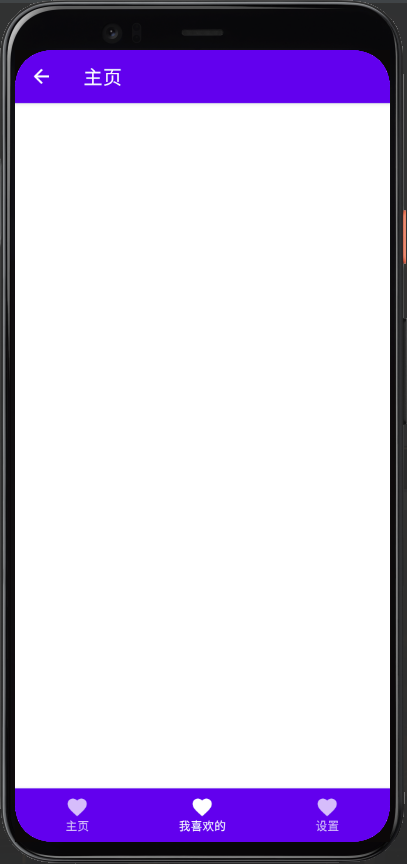

`Scaffold` 实现了 **Material Design** 的基本视图界面结构

``` kotlin
@Composable fun Scaffold(
    modifier: Modifier = Modifier, 
    scaffoldState: ScaffoldState = rememberScaffoldState(), 
    topBar: () -> Unit = {}, 
    bottomBar: () -> Unit = {}, 
    snackbarHost: (SnackbarHostState) -> Unit = { SnackbarHost(it) }, 
    floatingActionButton: () -> Unit = {}, 
    floatingActionButtonPosition: FabPosition = FabPosition.End, 
    isFloatingActionButtonDocked: Boolean = false, 
    drawerContent: ColumnScope.() -> Unit = null, 
    drawerGesturesEnabled: Boolean = true, 
    drawerShape: Shape = MaterialTheme.shapes.large, 
    drawerElevation: Dp = DrawerDefaults.Elevation, 
    drawerBackgroundColor: Color = MaterialTheme.colors.surface, 
    drawerContentColor: Color = contentColorFor(drawerBackgroundColor), 
    drawerScrimColor: Color = DrawerDefaults.scrimColor, 
    backgroundColor: Color = MaterialTheme.colors.background, 
    contentColor: Color = contentColorFor(backgroundColor), 
    content: (PaddingValues) -> Unit
): Unit
```
## 1. `topBar` 参数

`topBar` 是设置屏幕顶部的应用栏，我们可以考虑用自带的 `TopAppBar` 函数来实现

``` kotlin
@Composable
fun TopAppBar(
    title: @Composable () -> Unit,
    modifier: Modifier = Modifier,
    navigationIcon: @Composable (() -> Unit)? = null,
    actions: @Composable RowScope.() -> Unit = {},
    backgroundColor: Color = MaterialTheme.colors.primarySurface,
    contentColor: Color = contentColorFor(backgroundColor),
    elevation: Dp = AppBarDefaults.TopAppBarElevation
)
```

具体用法

``` kotlin
@Composable
fun ScaffoldDemo(){
    Scaffold(
        topBar = {
            TopAppBar(
                title = {
                    Text("主页")
                },
                navigationIcon = {
                    IconButton(onClick = {

                    }) {
                        Icon(Icons.Filled.ArrowBack, null)
                    }
                }
            )
        },
    ){

    }
}
```


## 2. bottomBar 参数

`bottomBar` 是设置屏幕底部的导航栏，我们可以考虑用 `BottomNavigation` 或者 `BottomAppBar` 来实现

``` kotlin
@Composable
fun ScaffoldDemo(){
    var selectedItem by remember { mutableStateOf(0) }
    val items = listOf("主页", "我喜欢的", "设置")
    Scaffold(
        topBar = {
            TopAppBar(
                title = {
                    Text("主页")
                },
                navigationIcon = {
                    IconButton(onClick = {

                    }) {
                        Icon(Icons.Filled.ArrowBack, null)
                    }
                }
            )
        },
        bottomBar = {
            BottomNavigation {
                items.forEachIndexed { index, item ->
                    BottomNavigationItem(
                        icon = { Icon(Icons.Filled.Favorite, contentDescription = null) },
                        label = { Text(item) },
                        selected = selectedItem == index,
                        onClick = { selectedItem = index }
                    )
                }
            }
        }
    ){

    }
}
```




这样一个基本的底部导航栏我们就实现啦，是不是很简单？

我们可以稍微修改一点代码，让导航栏变成三个不同的图标按钮

将 `BottomNavigationItem` 的代码修改成以下

``` kotlin
BottomNavigationItem(
    icon = {
        when(true){
            index == 0 -> Icon(Icons.Filled.Home, contentDescription = null)
            index == 1 -> Icon(Icons.Filled.Favorite, contentDescription = null)
            else -> Icon(Icons.Filled.Settings, contentDescription = null)
        }
    },
    label = { Text(item) },
    selected = selectedItem == index,
    onClick = { selectedItem = index }
)
```

