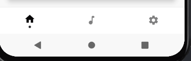

## 1. bottomBar

`bottomBar` 是设置屏幕底部的导航栏，我们可以考虑用 `BottomNavigation` 或者 `BottomAppBar` 来实现

``` kotlin
@Composable
fun ScaffoldDemo(){
    var selectedItem by remember { mutableStateOf(0) }
    val items = listOf("主页", "我喜欢的", "设置")
    Scaffold(
        topBar = {
            TopAppBar(
                title = {
                    Text("主页")
                },
                navigationIcon = {
                    IconButton(onClick = {

                    }) {
                        Icon(Icons.Filled.ArrowBack, null)
                    }
                }
            )
        },
        bottomBar = {
            BottomNavigation {
                items.forEachIndexed { index, item ->
                    BottomNavigationItem(
                        icon = { Icon(Icons.Filled.Favorite, contentDescription = null) },
                        label = { Text(item) },
                        selected = selectedItem == index,
                        onClick = { selectedItem = index }
                    )
                }
            }
        }
    ){

    }
}
```


这样一个基本的底部导航栏我们就实现啦，是不是很简单？

我们可以稍微修改一点代码，让导航栏变成三个不同的图标按钮

将 `BottomNavigationItem` 的代码修改成以下

``` kotlin
BottomNavigationItem(
    icon = {
        when(index){
            0 -> Icon(Icons.Filled.Home, contentDescription = null)
            1 -> Icon(Icons.Filled.Favorite, contentDescription = null)
            else -> Icon(Icons.Filled.Settings, contentDescription = null)
        }
    },
    label = { Text(item) },
    selected = selectedItem == index,
    onClick = { selectedItem = index }
)
```


## 2. 自定义 BottomNavigation

这是一个自定义底部导航栏的演示



代码可以通过以下的方式来查看

1. [Mkdocs](../../code/layout/scaffold/bottomNavigation.md)
2. [Github](https://github.com/compose-museum/compose-tutorial/blob/main/docs/code/layout/scaffold/bottomNavigation.md)

## 3. 更多
[BottomNavigation 详情](https://developer.android.com/reference/kotlin/androidx/compose/material/package-summary#BottomNavigation(androidx.compose.ui.Modifier,androidx.compose.ui.graphics.Color,androidx.compose.ui.graphics.Color,androidx.compose.ui.unit.Dp,kotlin.Function1))