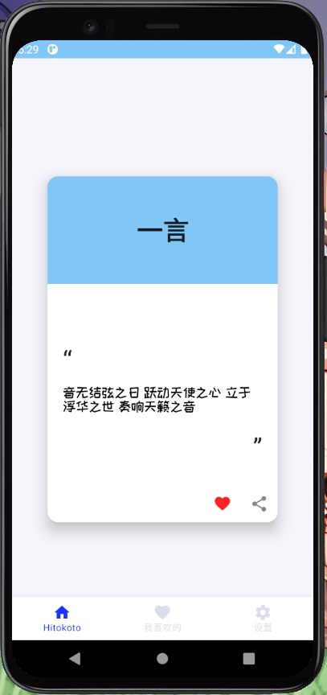

``` kotlin
@Composable fun Scaffold(
    modifier: Modifier = Modifier, 
    scaffoldState: ScaffoldState = rememberScaffoldState(), 
    topBar: () -> Unit = {}, 
    bottomBar: () -> Unit = {}, 
    snackbarHost: (SnackbarHostState) -> Unit = { SnackbarHost(it) }, 
    floatingActionButton: () -> Unit = {}, 
    floatingActionButtonPosition: FabPosition = FabPosition.End, 
    isFloatingActionButtonDocked: Boolean = false, 
    drawerContent: ColumnScope.() -> Unit = null, 
    drawerGesturesEnabled: Boolean = true, 
    drawerShape: Shape = MaterialTheme.shapes.large, 
    drawerElevation: Dp = DrawerDefaults.Elevation, 
    drawerBackgroundColor: Color = MaterialTheme.colors.surface, 
    drawerContentColor: Color = contentColorFor(drawerBackgroundColor), 
    drawerScrimColor: Color = DrawerDefaults.scrimColor, 
    backgroundColor: Color = MaterialTheme.colors.background, 
    contentColor: Color = contentColorFor(backgroundColor), 
    content: (PaddingValues) -> Unit
): Unit
```

`Scaffold` 实现了 **Material Design** 的基本视图界面结构

如以下的侧边应用栏、底部导航栏、导航栏等效果


