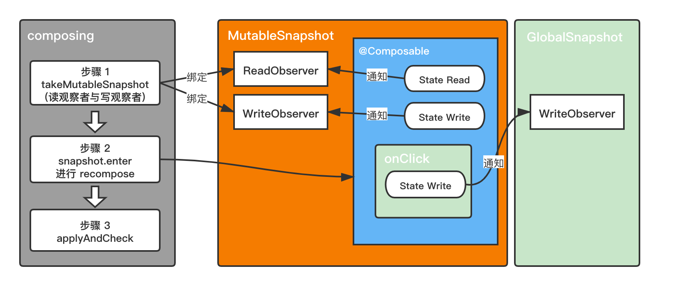

我们都知道 Jetpack Compose 是一套声明式 UI 系统，当 UI 组件所依赖的状态发生改变时会自动发生重绘刷新，这个过程被官方称作**重组**，前面已经总结过 [Compose 的重组范围](../../principle/recomposition_scope/)，以及 [重组过程使用的Snapshot](../../principle/snapshot/)。本文将带领大家来看看 Compose 源码中从状态更新到 recompose 过程在源码中是如何进行的，并且讲解快照系统在 recompose 过程中如何被使用到的。

## 意义

本文通过阅读源码来解读 recompose 流程，阅读源码其实是一个非常枯燥的过程，源码中存在着大量逻辑分支导致许多人看着看着就被绕晕了。本文剔除了所有与主线流程无关的逻辑分支，并结合配图进行逻辑表达，希望能够帮助大家理解 recompose 工作原理。通过这篇文章希望大家能够对 recompose工作原理产生一种感性认知，并在本文的基础上能够继续深入探索recompose流程中的各种技术细节。

 ⚠️ Tips：由于 recompose 流程十分复杂，本文目前仅对 recompose 主线流程进行了描述，其中包含的许多技术细节没有深挖。由于本人采用动静结合方式进行源码分析，难免出现有些case流程没有覆盖到的情况，如果文章存在错误欢迎提出。

## recompose 流程分析

### 从 MutableState 更新开始

当你为 MutableState 赋值时将会默认调用 MutableState 的扩展方法 `MutableState.setValue` 

```kotlin
// androidx.compose.runtime.SnapshotState
inline operator fun <T> MutableState<T>.setValue(thisObj: Any?, property: KProperty<*>, value: T) {
    this.value = value
}
```

通过查看 `mutableStateOf` 源码我们可以发现 MutableState 实际上是一个 `SnapshotMutableStateImpl` 类型实例

```kotlin
// androidx.compose.runtime.SnapshotState
fun <T> mutableStateOf(
    value: T,
    policy: SnapshotMutationPolicy<T> = structuralEqualityPolicy()
): MutableState<T> = createSnapshotMutableState(value, policy)

// androidx.compose.runtime.ActualAndroid.android
internal actual fun <T> createSnapshotMutableState(
    value: T,
    policy: SnapshotMutationPolicy<T>
): SnapshotMutableState<T> = ParcelableSnapshotMutableState(value, policy)

// androidx.compose.runtime.ParcelableSnapshotMutableState
internal class ParcelableSnapshotMutableState<T>(
    value: T,
    policy: SnapshotMutationPolicy<T>
) : SnapshotMutableStateImpl<T>(value, policy), Parcelable 
```

当 `value` 属性发生改变时会调用这个属性的 setter ，当然如果读取状态时也会走 getter。

此时的next是个 `StateStateRecord` 实例，其真正记录着当前state状态信息(通过当前value的getter与setter就可以看出)。此时首先会对当前值和要更新的值根据规则进行diff判断。当确定发生改变时会调用到 StateStateRecord 的 overwritable 方法。

```kotlin
// androidx.compose.runtime.SnapshotState
internal open class SnapshotMutableStateImpl<T>(
    value: T,
    override val policy: SnapshotMutationPolicy<T>
) : StateObject, SnapshotMutableState<T> {
    @Suppress("UNCHECKED_CAST")
    override var value: T
        get() = next.readable(this).value
        set(value) = next.withCurrent {
            if (!policy.equivalent(it.value, value)) {
                // 此时的this还是当前SnapshotMutableStateImpl
                next.overwritable(this, it) { 
                  this.value = value // 此时的this指向的next，这部操作也就是更新next其中的value
                } 
            }
        }
		...
    private var next: StateStateRecord<T> = StateStateRecord(value)
}
```

接下来会通过 `Snapshot.current` 获取当前上下文中的 Snapshot，如果你对 mutableState 更新操作在异步执行代码块中，其返回的实例类型是 `GlobalSnapshot` ，否则就是一个 `MutableSnapshot`。这将会影响到后续写入recompose的执行流程。

 

 ⚠️ Tips：GlobalSnapshot 实际上是 MutableSnapShot 的子类

```kotlin
// androidx.compose.runtime.snapshots.Snapshot
internal inline fun <T : StateRecord, R> T.overwritable(
    state: StateObject,
    candidate: T,
    block: T.() -> R
): R {
    var snapshot: Snapshot = snapshotInitializer
    return sync {
        snapshot = Snapshot.current
        this.overwritableRecord(state, snapshot, candidate).block() // 更新 next
    }.also {
        notifyWrite(snapshot, state) // 写入通知
    }
}
```

我们进入 `overwritableRecord ` 看看其中做了什么，注意此时 state 其实是 mutableState。在这其中通过 `recordModified` 方法记录了修改。我们可以看到此时将当前修改的 state 添加到当前 Snapshot 的 modified 中了，这个后续会用到的。

```kotlin
// androidx.compose.runtime.snapshots.Snapshot
internal fun <T : StateRecord> T.overwritableRecord(
    state: StateObject,
    snapshot: Snapshot,
    candidate: T
): T {
    if (snapshot.readOnly) {
        snapshot.recordModified(state)
    }
    val id = snapshot.id

    if (candidate.snapshotId == id) return candidate

    val newData = newOverwritableRecord(state, snapshot)
    newData.snapshotId = id

    snapshot.recordModified(state) // 记录修改

    return newData
}

// androidx.compose.runtime.snapshots.Snapshot
override fun recordModified(state: StateObject) {
    (modified ?: HashSet<StateObject>().also { modified = it }).add(state)
}
```

可能你对 mutableState 更新操作是否在 ComposeScope 中而感到困惑，举个例子其实就明白了。recompose 能够执行到就在 ComposeScope 中，不能执行到就不在 ComposeScope 中。

这个在后面 [***takeMutableSnapshot读观察者与写观察者*** ](#takemutablesnapshot) 部分是会进行解释。

```kotlin
var display by mutableStateOf("Init")
@Preview
@Composable
fun Demo() {
    Text (
        text = display,
        fontSize = 50.sp,
        modifier = Modifier.clickable {
            display = "change" // recompose不能执行到，此时是 GlobalSnapshot
        }
    )
  	display = "change" // recompose能够执行到，此时是 MutableSnapShot
}
```

接下来就是通过 `notifyWrite` 执行事件通知此时可以看到调用了写观察者 `writeObserver` 。

```kotlin
// androidx.compose.runtime.snapshots.Snapshot
@PublishedApi
internal fun notifyWrite(snapshot: Snapshot, state: StateObject) {
    snapshot.writeObserver?.invoke(state)
}
```

此时会根据当前 Snapshot 不同而调用到不同的写观察者 `writeObserver` 。

### GlobalSnapshot 写入通知

全局的写入观察者是在 `setContent` 时就进行了注册， 此时会回调 registerGlobalWriteObserver 的尾lambda，可以看到这里就一个channel (没错就是Kotlin协程那个热数据通道Channel)，我门可以看到很容易看到在上方以AndroidUiDispatcher.Main 作为调度器的 CoroutineScope 中进行了挂起等待消费，所以执行流程自然会进到了 `sendApplyNotifications()` 。 （AndroidUiDispatcher.Main 与 Choreographer 息息相关，篇幅有限就不展开讨论了，有兴趣可以自己去跟源码）

```kotlin
internal object GlobalSnapshotManager {
    private val started = AtomicBoolean(false)

    fun ensureStarted() {
        if (started.compareAndSet(false, true)) {
            val channel = Channel<Unit>(Channel.CONFLATED)
            CoroutineScope(AndroidUiDispatcher.Main).launch {
                channel.consumeEach {
                    Snapshot.sendApplyNotifications()
                }
            }
            Snapshot.registerGlobalWriteObserver {
                channel.offer(Unit)
            }
        }
    }
}
```

#### sendApplyNotifications

接下来，我们进入 `sendApplyNotifications()` 其中看看做了什么，可以看到这里使用我们前面提到的那个 `modified` ，当发生修改时 changes 必然为 true，所以接着会调用到 `advanceGlobalSnapshot`

``` kotlin
// androidx.compose.runtime.snapshots.Snapshot
fun sendApplyNotifications() {
		val changes = sync {
    		currentGlobalSnapshot.get().modified?.isNotEmpty() == true
  	}
  	if (changes)
  			advanceGlobalSnapshot()
}
```

我们继续往下跟下去走到了 `advanceGlobalSnapshot` ，此时将所有 `modified` 取出并便利调用 `applyObservers` 中包含的所有观察者。 

```kotlin
// androidx.compose.runtime.snapshots.Snapshot
private fun advanceGlobalSnapshot() = advanceGlobalSnapshot { }

private fun <T> advanceGlobalSnapshot(block: (invalid: SnapshotIdSet) -> T): T {
    val previousGlobalSnapshot = currentGlobalSnapshot.get()
    val result = sync {
        takeNewGlobalSnapshot(previousGlobalSnapshot, block)
    }
    val modified = previousGlobalSnapshot.modified
    if (modified != null) {
        val observers: List<(Set<Any>, Snapshot) -> Unit> = sync { applyObservers.toMutableList() }
        observers.fastForEach { observer ->
            observer(modified, previousGlobalSnapshot)
        }
    }
    ....
    return result
}
```

#### applyObservers之recompositionRunne

 

据我调查此时 `applyObservers` 中包含的观察者仅有两个，一个是 `SnapshotStateObserver.applyObserver` 用来更新快照状态信息，另一个就是 `recompositionRunner` 用来处理 recompose流程 的。由于我们是在研究recompose 流程的所以就不分开去讨论了。我们来看看处理 recompose 的 observer 都做了什么，首先他将所有改变的 `mutableState` 添加到了 `snapshotInvalidations`，这个后续会用到。后面可以看到有一个resume，说明lambda的最后调用的 `deriveStateLocked` 返回了一个协程 Continuation 实例。使得挂起点位置恢复执行，所以我们进入`deriveStateLocked ` 看看这个协程 Continuation 实例到底是谁。

```kotlin
// androidx.compose.runtime.Recomposer
@OptIn(ExperimentalComposeApi::class)
private suspend fun recompositionRunner(
    block: suspend CoroutineScope.(parentFrameClock: MonotonicFrameClock) -> Unit
) {
    withContext(broadcastFrameClock) {
        ...
        // 负责处理 recompose 的 observer 就是他
        val unregisterApplyObserver = Snapshot.registerApplyObserver { 
            changed, _ ->
                synchronized(stateLock) {
                    if (_state.value >= State.Idle) {
                        snapshotInvalidations += changed
                        deriveStateLocked()
                    } else null
                }?.resume(Unit)
        }
        ....
    }
}
```

通过函数返回值可以看到这是一个可取消的Continuation实例 `workContinuation`，

```kotlin
// androidx.compose.runtime.Recomposer
private fun deriveStateLocked(): CancellableContinuation<Unit>? {
  	....
    return if (newState == State.PendingWork) {
        workContinuation.also {
        		workContinuation = null
    		}
    } else null
}
```

那这个workContinuation是在哪里赋值的呢，我们很容易就找到了其唯一被赋值的地方。此时 workContinuation 就是 co，此时resume也就是恢复执行 `awaitWorkAvailable` 调用挂起点。

```kotlin
// androidx.compose.runtime.Recomposer
private suspend fun awaitWorkAvailable() {
    if (!hasSchedulingWork) {
        suspendCancellableCoroutine<Unit> { co ->
            synchronized(stateLock) {
                if (hasSchedulingWork) {
                    co.resume(Unit)
                } else {
                    workContinuation = co
                }
            }
        }
    }
}
```

#### runRecomposeAndApplyChanges 三步骤

我们可以找到在 `runRecomposeAndApplyChanges` 中调用 `awaitWorkAvailable` 而产生了挂起，所以此时会恢复调用 `runRecomposeAndApplyChanges` ，这里主要有三步操作接下来进行介绍

```kotlin
// androidx.compose.runtime.Recomposer
suspend fun runRecomposeAndApplyChanges() = recompositionRunner { parentFrameClock ->
    val toRecompose = mutableListOf<ControlledComposition>()
    val toApply = mutableListOf<ControlledComposition>()
    while (shouldKeepRecomposing) {
        awaitWorkAvailable()
        // 从这开始恢复执行
        if (
            synchronized(stateLock) {
                if (!hasFrameWorkLocked) {
                   	// 步骤1
                    recordComposerModificationsLocked()
                    !hasFrameWorkLocked
                } else false
            }
        ) continue

        // 等待Vsync信号，类似于传统View系统中scheduleTraversals?
        parentFrameClock.withFrameNanos { frameTime ->
            ...
            trace("Recomposer:recompose") {
                synchronized(stateLock) {
                    recordComposerModificationsLocked()
										// 步骤2
                    compositionInvalidations.fastForEach { toRecompose += it }
                    compositionInvalidations.clear()
                }
              
                val modifiedValues = IdentityArraySet<Any>()
                val alreadyComposed = IdentityArraySet<ControlledComposition>()
                while (toRecompose.isNotEmpty()) {
                    try {
                        toRecompose.fastForEach { composition ->
                            alreadyComposed.add(composition)
                            // 步骤3
                            performRecompose(composition, modifiedValues)?.let {
                                toApply += it
                            }
                        }
                    } finally {
                        toRecompose.clear()
                    }
                    ....
                }
                ....
            }
        }
    }
}
```

对于这三个步骤，我们分别来看首先是步骤1调用了 `recordComposerModificationsLocked` 方法， 还记得 `snapshotInvalidations` 嘛, 他记录着所有更改的 mutableState，此时回调所有已知composition的`recordModificationsOf` 方法。

```kotlin
// androidx.compose.runtime.Recomposer
private fun recordComposerModificationsLocked() {
    if (snapshotInvalidations.isNotEmpty()) {
        snapshotInvalidations.fastForEach { changes ->
            knownCompositions.fastForEach { composition ->
                composition.recordModificationsOf(changes)
            }
        }
        snapshotInvalidations.clear()
        if (deriveStateLocked() != null) {
            error("called outside of runRecomposeAndApplyChanges")
        }
    }
}
```

经过一系列调用会将所有依赖当前 mutableState 的所有 Composable Scope 存入到 `compositionInvalidations` 这个 List 中。

```kotlin
// androidx.compose.runtime.Recomposer
internal override fun invalidate(composition: ControlledComposition) {
    synchronized(stateLock) {
        if (composition !in compositionInvalidations) {
            compositionInvalidations += composition
            deriveStateLocked()
        } else null
    }?.resume(Unit)
}
```

步骤2就很简单了，将 compositionInvalidations 的所有元素转移到了 toRecompose，而步骤3则是 recompose的重中之重，通过 `performRecompose` 使所有受到影响的 Composable Scope 重新执行。

#### performRecompose

我们可以看到 `performRecompose` 中间接调用了 `composing` ，而其中最关键 `recompose` 也在回调中完成，那么我们需要再进入 `composing` 看看什么时候会回调。

```kotlin
// androidx.compose.runtime.Recomposer
private fun performRecompose(
    composition: ControlledComposition,
    modifiedValues: IdentityArraySet<Any>?
): ControlledComposition? {
    if (composition.isComposing || composition.isDisposed) return null
    return if (
        composing(composition, modifiedValues) {
            if (modifiedValues?.isNotEmpty() == true) {
                composition.prepareCompose {
                    modifiedValues.forEach { composition.recordWriteOf(it) }
                }
            }
            composition.recompose() // 真正发生recompose的地方
        }
    ) composition else null
}
```

 `composing` 内部首先拍摄了一次快照，然后将我们的recompose过程在这次快照中执行，最后进行了apply。又关于快照系统的讲解详见 [《Jetpack Compose · 快照系统》](https://juejin.cn/post/6972692477505437733)。 

```kotlin
// androidx.compose.runtime.Recomposer
private inline fun <T> composing(
  composition: ControlledComposition,
  modifiedValues: IdentityArraySet<Any>?,
  block: () -> T
): T {
  val snapshot = Snapshot.takeMutableSnapshot(
    readObserverOf(composition), writeObserverOf(composition, modifiedValues)
  )
  try {
    return snapshot.enter(block)
  } finally {
    applyAndCheck(snapshot)
  }
}
```

#### takeMutableSnapshot 读观察者与写观察者 

 

值得注意的是此时调用的 `takeMutableSnapshot` 方法同时传入了一个读观察者和写观察者，而这两个观察者在什么时机回调呢？当我们每次 recompose 时都会拍摄一次快照，然后我们的重新执行过程在这次快照中执行，在重新执行过程中如果出现了 mutableState 的读取或写入操作都会相应的回调这里的读观察者和写观察者。也就说明每次recompose都会进行重新一次绑定。 读观察者回调时机比较好理解，写观察者在什么时机回调呢？ 还记得我们刚开始说的 `GlobalSnapshot` 和 `MutableSnapshot` 嘛？

到这里我们一直都在分析 `GlobalSnapshot` 这条执行过程，通过调用 `takeMutableSnapshot` 将返回一个 `MutableSnapshot` 实例，我们的recompose重新执行过程发生在当前`MutableSnapshot` 实例的`enter` 方法中，此时重新执行过程中通过调用`Snapshot.current  `将返回当前`MutableSnapshot` 实例，所以重新执行过程中发生的写操作就会回调 `takeMutableSnapshot` 所传入的写观察者。也就是以下这种情况，当 Demo 发生recompose时 display所在 Snapshot 就是拍摄的`MutableSnapshot` 快照。

```kotlin
var display by mutableStateOf("Init")
@Preview
@Composable
fun Demo() {
    Text (
        text = display,
        fontSize = 50.sp
    )
  	display = "change" // recompose能够执行到，此时是 MutableSnapShot
}
```

### MutableSnapshot 写入通知 

接下来，我们来看看 `takeMutableSnapshot` 的写观察者是如何实现的。此时会将更新的值传入当前recompose composition 的 `recordWriteOf` 方法。

```kotlin
// androidx.compose.runtime.Recomposer
private fun writeObserverOf(
    composition: ControlledComposition,
    modifiedValues: IdentityArraySet<Any>?
): (Any) -> Unit {
    return { value ->
        composition.recordWriteOf(value)
        modifiedValues?.add(value)
    }
}
```

通过对于流程分析发现，实际上在recompose过程中进行状态写入操作时，并不会通过写观察者立即进行recompose 过程，而是等待到当前recompose过程结束后进行 apply 时再进行重新 recompose。

#### applyAndCheck

让我们回到Recomposer的 `composing` 方法，我们通过 `applyAndCheck` 完成后续 apply 操作。`applyAndCheck` 内部使用了 `MutableSnapshot.apply`

```kotlin
// androidx.compose.runtime.Recomposer
private inline fun <T> composing(
    composition: ControlledComposition,
    modifiedValues: IdentityArraySet<Any>?,
    block: () -> T
): T {
    val snapshot = Snapshot.takeMutableSnapshot(
        readObserverOf(composition), writeObserverOf(composition, modifiedValues)
    )
    try {
        return snapshot.enter(block)
    } finally {
        applyAndCheck(snapshot) // 在这里
    }
}

private fun applyAndCheck(snapshot: MutableSnapshot) {
    val applyResult = snapshot.apply()
    if (applyResult is SnapshotApplyResult.Failure) {
        error(
            "Unsupported concurrent change during composition. A state object was " +
                "modified by composition as well as being modified outside composition."
        )
    }
}
```

#### apply中使用的applyObservers

我们再进入`MutableSnapshot.apply` 一探究竟，此时将当前 modified 在 `snapshot.recordModified(state)` 已经更新过了，忘记的话可以回头看看，前面已经讲过了。此时仍然使用了 `applyObservers` 进行遍历通知。这个`applyObservers` 其实是个静态变量，所以不同的 GlobalSnapshot 与MutableSnapshot 可以共享，接下来仍然通过预先订阅好的 `recompositionRunner` 用来处理 recompose 过程，详见 [***applyObservers之recompositionRunner***](#applyobserversrecompositionrunne)，接下来的recompose流程就完全相同了。

```kotlin
// androidx.compose.runtime.snapshots.Snapshot
open fun apply(): SnapshotApplyResult {
    val modified = modified
    ....
    val (observers, globalModified) = sync {
        validateOpen(this)
        if (modified == null || modified.size == 0) {
            ....
        } else {
            ....
            applyObservers.toMutableList() to globalModified
        }
    }
  	....
    if (modified != null && modified.isNotEmpty()) {
        observers.fastForEach {
            it(modified, this)
        }
    }
    return SnapshotApplyResult.Success
}
```

