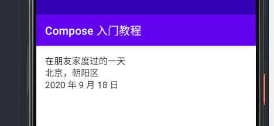
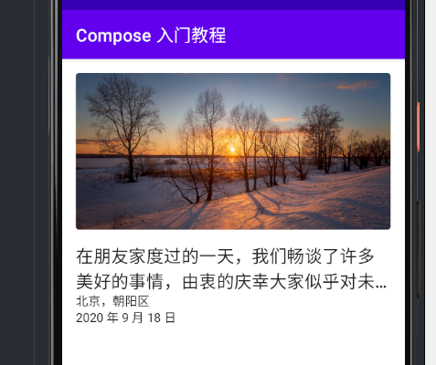

## 介绍

`Jetpack Compose` 是一个用于构建原生 `Android UI` 的现代工具包。`Jetpack Compose` 用更少的代码、强大的工具和直观的 `Kotlin API` 简化并加速了 `Android` 上的 `UI` 开发。

在本教程中，你将用声明式函数构建一个简单的 `UI` 组件。你将不会编辑任何 `XML` 布局或直接创建 `UI` 部件。相反，你将调用 `Jetpack Compose` 函数来说明你想要的元素，剩下的就由 `Compose` 编译器来完成。

!!! note "注意"
    `Jetpack Compose` 目前还处于 `beta` 阶段，请参阅 `Jetpack` [发布](https://developer.android.com/jetpack/androidx/versions/all-channel) 说明，了解最新的更新。

## 1. 第一步：Composable 函数

`Jetpack Compose `是围绕着 `Composable` 函数建立的。这些函数让你通过描述它的形状和数据依赖性，以编程方式定义你的应用程序的用户界面，而不是专注于用户界面的构建过程。要创建一个 `Composable` 函数，只需在函数名称中添加 `@Composable` 注解。


### 添加一个 text 元素</h3>

现在你可以在你的 `activity` 添加一个 `text` 元素。你可以通过定义一个内容块，并调用 `Text()` 函数来实现。

`setContent` 块定义了这个 `activity` 的布局。我们不使用 `XML` 文件来定义布局内容，而是调用 `Composable` 函数。`Jetpack Compose `使用一个自定义的 `Kotlin` 编译器插件来将这些 `Composable` 函数转化为应用程序的 `UI` 元素。例如，`Text()` 函数是由 `Compose UI` 库定义的；你调用这个函数来声明你的应用程序中的文本元素。

``` kotlin
class MainActivity : ComponentActivity() {
    override fun onCreate(savedInstanceState: Bundle?) {
        super.onCreate(savedInstanceState)
        setContent {
            Text("Hello world!")
        }
    }
}
```


### 定义一个 composable 函数

`composable` 函数只能从其他 `composable` 函数的范围内调用。要使用一个 `composable` 函数，请添加 `@Composable` 注解。为了尝试理解这一点，我们可以定义一个 `Greeting()` 函数，它包含了一个 `name` 参数，并使用这个参数来配置文本元素

``` kotlin
class MainActivity : ComponentActivity() {
    override fun onCreate(savedInstanceState: Bundle?) {
        super.onCreate(savedInstanceState)
        setContent {
            Greeting("Android")
        }
    }
}

@Composable
fun Greeting(name: String) {
    Text (text = "Hello $name!")
}
```


### 在 Android Studio 中预览你的函数

目前，`Android Studio Canary` 版本可以让你在 `IDE` 中预览你的 `Composable` 函数，而不需要将应用下载到 `Android` 设备或模拟器上。主要的限制是, `Composable` 函数必须不能携带任何参数。由于这个原因，你不能直接预览 `Greeting()` 函数。但是，你可以尝试写第二个名为 `PreviewGreeting()` 的函数，它调用带有适当参数的 `Greeting()`。在 `@Composable` 之前添加 `@Preview` 注解。

``` kotlin
@Composable
fun Greeting(name: String) {
    Text (text = "Hello $name!")
}

@Preview
@Composable
fun PreviewGreeting() {
    Greeting("Android")
}
```

重新运行你的项目。应用程序本身并没有改变，因为新的 `previewGreeting()` 函数并没有在任何地方被调用，但 `Android Studio` 增加了一个预览窗口。这个窗口显示了由标有 `@Preview` 注解的 `Composable` 函数创建的 `UI` 元素的预览。要在任何时候更新预览，请点击预览窗口顶部的刷新按钮。


## 2. 第二步：界面

`UI` 元素是分层次的，元素包含在其他元素中。在 `Compos` e中，你通过从其他 `Composable` 函数中调用 `Composable` 函数来建立一个 `UI` 层次结构。


### 让我们从一些文本开始

回到你的 `activity`，用一个新的 `NewsStory()` 函数替换 `Greeting()` 函数。在本教程的其余部分，你将修改 `NewsStory()` 函数，而不会再去碰 `Activity` 的代码。

创建独立的、不被应用程序调用的预览函数是一种最佳做法；有专门的预览函数可以提高性能，也可以使以后设置多个预览更容易。因此，创建一个默认的预览函数，除了调用 `NewsStory()` 函数，什么都不做。当你通过本教程对 `NewsStory(` )进行修改时，预览会反映这些修改。

这段代码在内容视图内创建了三个文本元素。然而，由于我们并没有安排如何排布它们，这三个文本元素重叠在了一块，使得文本无法阅读。


### 使用 Column

`Column` 函数可以让你垂直地堆叠元素。在 `NewsStory(` )函数中加入 `Column`。

默认设置是直接堆叠所有的子元素，一个接一个，没有间隔。`Column` 本身被放在内容视图的左上角。

``` kotlin
@Composable
fun NewsStory() {
    Column {
        Text("在朋友家度过的一天")
        Text("北京，朝阳区")
        Text("2020 年 9 月 18 日")
    }
}
```


### 给 Column 添加样式设置

通过向 `Column` 调用传递参数，你可以设置 `Column` 的大小和位置，以及 `Column` 的子项如何排列。

设置有以下含义。

`modifier`：让你配置布局。在这个情况下，应用一个 `Modifier.padding` **modifier**，会将 `Column` 从周围的视图中嵌入。

``` kotlin
@Composable
fun NewsStory() {
    Column(
        modifier = Modifier.padding(16.dp)
    ){
        Text("在朋友家度过的一天")
        Text("北京，朝阳区")
        Text("2020 年 9 月 18 日")
    }
}
```



### 添加一张图片

我们要在文本上方添加一张图片。使用资源管理器将这张照片添加到你的应用程序的 `drawable resources` 中，名称为 header。


<a href = "../assets/tutorial/header.jpg" download>下载图片</a>

现在修改你的 `NewsStory()` 函数。你将添加一个 `Image()` 函数，并把这张图片放在 `Column` 中。这些 `composables` 在 `foundation` 包中可用，你可能需要添加它。见 [Jetpack Compose 设置说明](https://developer.android.com/jetpack/compose/setup)。图片的比例不会正确，但这没关系，你将在下一步解决这个问题。

``` kotlin
@Composable
fun NewsStory() {
    Column(
        modifier = Modifier.padding(16.dp)
    ) {
        Image(
            painter = painterResource(R.drawable.header),
            contentDescription = null
        )

        Text("在朋友家度过的一天")
        Text("北京，朝阳区")
        Text("2020 年 9 月 18 日")
    }
}
```


!!! note "注意"
    你还需要为图片提供一个 `contentDescription`。这个描述用于无障碍。然而，在这种情况下，图像纯粹是装饰性的，将描述设置为空是合适的。

图片被添加到你的布局中，但它的大小还不合适。要设计图片，请在调用 `Image()` 时传递一个 `size Moidifer`。

`height(180.dp)`。指定图像的高度。

`fillMaxWidth()`。指定图像的宽度应足以填满它所属的布局。

你还需要向 `Image()` 传递一个 `contentScale` 参数。

`contentScale = ContentScale.Crop`：指定图片应该填满这个 `Column` 的宽度，如果有必要，还可以裁剪到合适的高度。

``` kotlin
@Composable
fun NewsStory() {
    Column(
        modifier = Modifier.padding(16.dp)
    ){
        Image(
            painter = painterResource(R.drawable.header),
            contentDescription = null,
            modifier = Modifier
                .height(180.dp)
                .fillMaxWidth(),
            contentScale = ContentScale.Crop
        )
        Text("在朋友家度过的一天")
        Text("北京，朝阳区")
        Text("2020 年 9 月 18 日")
    }
}
```


添加一个 `Spacer`，将图片与标题分开。

``` kotlin hl_lines="14"
@Composable
fun NewsStory() {
    Column(
        modifier = Modifier.padding(16.dp)
    ){
        Image(
            painter = painterResource(R.drawable.header),
            contentDescription = null,
            modifier = Modifier
                .height(180.dp)
                .fillMaxWidth(),
            contentScale = ContentScale.Crop
        )
        Spacer(Modifier.height(16.dp))
        Text("在朋友家度过的一天")
        Text("北京，朝阳区")
        Text("2020 年 9 月 18 日")
    }
}
```


## 第三步：Material design

`Compose` 是为支持 `Material design` 原则而建立的。它的许多 `UI` 元素都是开箱即用的 `Material design`。在这一步中，你将用 `Material` 小部件来设计你的应用程序。


### 应用一个形状

`Material design` 系统的支柱之一是形状。使用 `clip()` 函数将图片的边角修圆。

形状是不可见的，但图片被裁剪以适应形状，所以它现在有轻微的圆角。

``` kotlin
@Composable
fun NewsStory() {
    Column(
        modifier = Modifier.padding(16.dp)
    ){
        Image(
            painter = painterResource(R.drawable.header),
            contentDescription = null,
            modifier = Modifier
                .height(180.dp)
                .fillMaxWidth()
                .clip(shape = RoundedCornerShape(4.dp)),
            contentScale = ContentScale.Crop
        )
        Spacer(Modifier.height(16.dp))
        Text("在朋友家度过的一天")
        Text("北京，朝阳区")
        Text("2020 年 9 月 18 日")
    }
}
```


### 文字风格

`Compose` 可以让你轻松地利用 `Material Design` 原则。将 `MaterialTheme` 应用于你所创建的组件。

``` kotlin
@Composable
fun NewsStory() {
    MaterialTheme {
        Column(
            modifier = Modifier.padding(16.dp)
        ){
            Image(
                painter = painterResource(R.drawable.header),
                contentDescription = null,
                modifier = Modifier
                    .height(180.dp)
                    .fillMaxWidth()
                    .clip(shape = RoundedCornerShape(4.dp)),
                contentScale = ContentScale.Crop
            )
            Spacer(Modifier.height(16.dp))
            Text("在朋友家度过的一天")
            Text("北京，朝阳区")
            Text("2020 年 9 月 18 日")
        }
    }
}
```


变化是微妙的，但现在的文本使用 `MaterialTheme` 的默认文本样式。接下来，对每个文本元素应用特定的段落样式。

``` kotlin
@Composable
fun NewsStory() {
    MaterialTheme {
        val typography = MaterialTheme.typography
        Column(
            modifier = Modifier.padding(16.dp)
        ){
            Image(
                painter = painterResource(R.drawable.header),
                contentDescription = null,
                modifier = Modifier
                    .height(180.dp)
                    .fillMaxWidth()
                    .clip(shape = RoundedCornerShape(4.dp)),
                contentScale = ContentScale.Crop
            )
            Spacer(Modifier.height(16.dp))
            Text("在朋友家度过的一天",
                style = typography.h6)
            Text("北京，朝阳区",
                style = typography.body2)
            Text("2020 年 9 月 18 日",
                style = typography.body2)
        }
    }
}
```


在这种情况下，文章的标题是相当短的。但有时一篇文章的标题很长，我们不希望这个长标题影响到应用程序的外观。试着改变第一个文本元素。

``` kotlin
Text("在朋友家度过的一天，我们畅谈了许多美好的事情，由衷的庆幸大家似乎对未来有了更好的期待",
    style = typography.h6)
Text("北京，朝阳区",
    style = typography.body2)
Text("2020 年 9 月 18 日",
    style = typography.body2)
```


``` kotlin
Text("在朋友家度过的一天，我们畅谈了许多美好的事情，由衷的庆幸大家似乎对未来有了更好的期待",
    style = typography.h6,
    maxLines = 2,
    overflow = TextOverflow.Ellipsis)
Text("北京，朝阳区",
    style = typography.body2)
Text("2020 年 9 月 18 日",
    style = typography.body2)
```



## 4. 完成

恭喜你，看到这里
你已经学会了 `Compose` 的基础知识。

我掌握了什么？

* 定义一个 `Composable` 函数
* 使用和改造 `Column` 来改善布局
* 用 `Material Design` 原则来设计你的应用程序

如果你想深入了解其中的一些步骤，请探索下面的资源。

|设计||
|----|----|
|[布局概述](../layout/overview/)||
|[动画概述](../design/animation/overview/)||
|[主题概述](../design/theme/overview/)||
|[手势概述](../design/gesture/overview/)||
|[列表概述](../design/lists/overview/)||